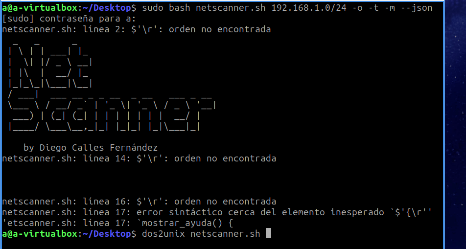
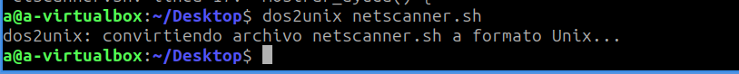

[Volver a inicio](../index.md)

# NetScanner by Diego Calles Fernández
## Proyecto 1ª Evaluación ASO

Programa escrito en *Bash* que analiza direcciones de red de tipo `/8`, `/16` y `/24` en busca de equipos. Además, el programa examina los puertos abiertos de dichos equipos.

## Índice

- [NetScanner by Diego Calles Fernández](#netscanner-by-diego-calles-fernández)
  - [Proyecto 1ª Evaluación ASO](#proyecto-1ª-evaluación-aso)
  - [Índice](#índice)
  - [Descripcion](#descripcion)
  - [Requisitos](#requisitos)
  - [Uso](#uso)
  - [Troubleshooting](#troubleshooting)

## Descripcion

Este script escanea un rango de direcciones IP y, opcionalmente, guarda el resultado en un archivo si se especifica la opción `-o` o `--output`. También puede mostrar la dirección MAC de cada equipo y registrar el tiempo de ejecución.


## Requisitos
- Bash
- `ping`
- `nc` (netcat)
- `arp`
- `jq` (para salida en JSON, si se utiliza)


## Uso
```bash
sudo bash ./netscanner.sh <rango_ip> [-o archivo_salida] [-m] [-t] [--json]

```


## Troubleshooting

Este error puede aparecer cuando ejecutamos el script en Linux:



Para solucionarlo, debemos instalar la aplicación `dos2unix`:

```bash
sudo apt-get install dos2unix
```

Una vez instalada , hacemos lo siguiente:



Ahora ya podremos utilizarlo con total normalidad