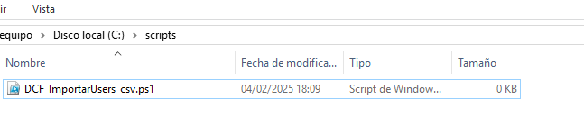
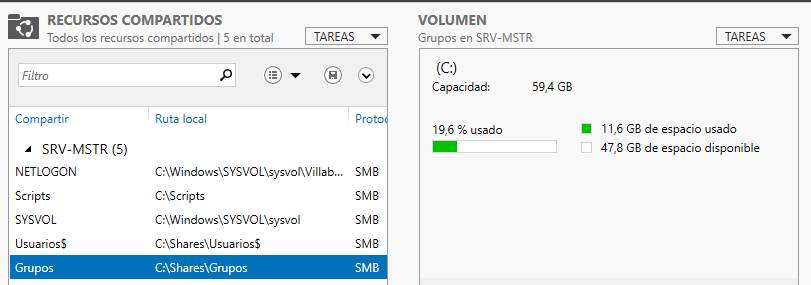
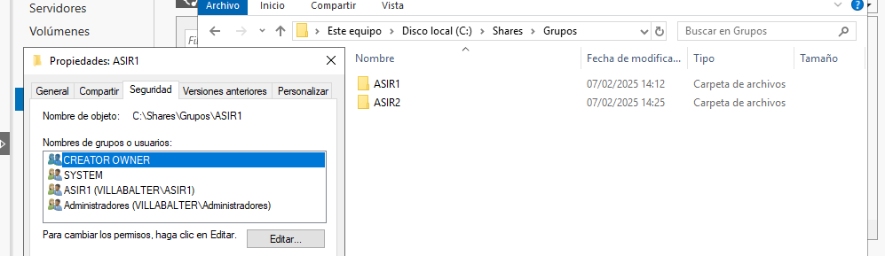
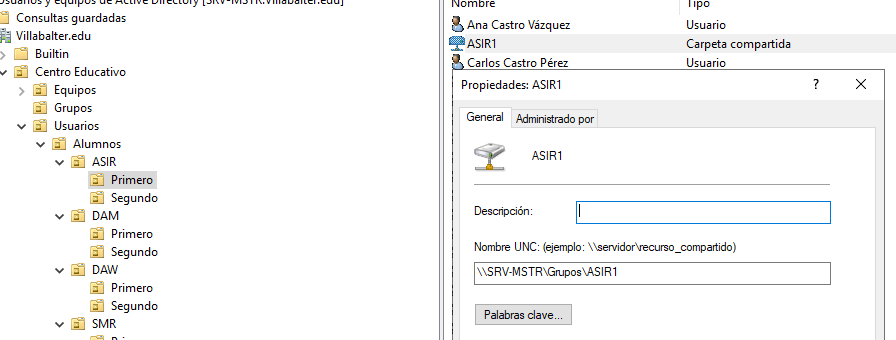
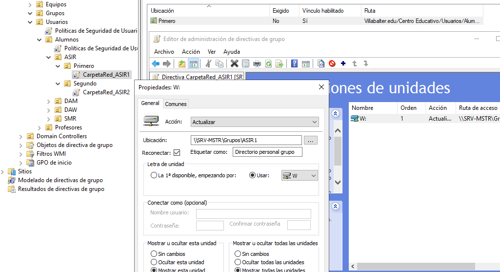

[Volver a inicio](../index.md)

A través del siguiente enlace podrá consultar las notas que he ido tomando para constituir este dominio educativo

[Notas](notas.md)

# Proyecto 2º Evaluación: Dominio Educativo  

## Villabalter.edu  

### Características del Servidor  

- **Nombre de equipo:** SRV-MSTR  
- **Dominio:** Villabalter.edu  
- **Sistema Operativo:** Windows Server 2019 (Datacenter)  
- **Tipo de Disco Duro:** NVMe (Partición GPT)  
- **Direcciones IP:**  
  - **Interfaz de internet:** DHCP (NAT)  
  - **Interfaz local:** 192.168.1.254  
- **Dirección MAC:** 00:50:56:38:2A:4B  
- **DNS:** Villabalter  
  - **DNS principal:** Servidor  
  - **DNS secundario:** 8.8.4.4 (Google)  

### Configuración Básica  

Como primer paso en la instalación y configuración de este dominio educativo, es necesario contar con una máquina Windows Server 2019.  

Los primeros pasos en esta configuración básica incluyen establecer el nombre del equipo y definir las direcciones IP:  

- **Nombre del equipo:** SRV-MSTR  
- **Interfaz de internet:** DHCP  
- **Interfaz de red local:** 192.168.1.0/24  
  - **IP del servidor:** 192.168.1.254/24  

  

### Alta Disponibilidad  

Para garantizar alta disponibilidad, se añadirá redundancia mediante un RAID-1 con dos discos NVMe, asegurando la integridad de los datos en caso de fallo de uno de los discos.  

### Instalación de Servicios  

Dado que este servidor actuará como controlador principal del dominio, es necesario instalar los siguientes roles:  

#### **Roles Instalados**  

- Servicios de Dominio de Active Directory  
- DNS  
- Servicios de Impresión y Documentos  

  

#### **Opciones del Controlador**  

- **Nombre del Bosque:** Villabalter.edu  
- **Nivel Funcional del Bosque y Dominio:** Windows Server 2016  
- **Contraseña:** Villabalter1 *(En un entorno real se recomienda una contraseña segura como:* **I36m}0":2?Zw** *)*  
- **Nombre de dominio NETBIOS:** VILLABALTER  
- **Carpetas:**  
  - **Base de datos:** C:\Windows\NTDS  
  - **Archivos de registro:** C:\Windows\NTDS  
  - **SYSVOL:** C:\Windows\SYSVOL  

### Servicio de Impresión  

Además de los roles mencionados, se instalará la característica de impresión para que los profesores puedan imprimir en red desde el aula.  

- **Impresora disponible:**  
  - **Nombre:** IMP-PROF  
  - **Dirección IP:** 192.168.1.230  

#### **Panel Web**  

*(Apuntar lo que contiene el panel web)*  

#### **Servicio LPD**  

Este servicio permitirá la impresión desde equipos UNIX (ya sean físicos o máquinas virtuales) que formen parte del dominio.  

El servidor desplegará la impresora compartida en toda la red.  

### Unidades Organizativas  

Se establecerá la siguiente estructura de Unidades Organizativas para mejorar la gestión del dominio:  

  

Una vez definidas las unidades organizativas, se procederá a la creación de los siguientes grupos dentro de sus respectivas UO:  

  

### Automatización  

Con la instalación y configuración del dominio finalizadas, se procederá a la automatización del alta de alumnos.  

El alta de usuarios se realizará utilizando un archivo **.csv** como referencia.  

EL primer paso es crear un directorio en **C:** que se llame ***scripts** y en su interior crearemos el archivo con extensión **ps1**.



El codigo del script **DCF_ImportarUsers_csv.ps1** es el siguiente:

```powershell
<#
    .TITULO
    Importador automático de usuarios en Powershell

    .DESCRIPCION
    Este script importa usuarios desde un archivo CSV y los crea automáticamente en Active Directory, asignándoles la Unidad Organizativa (OU) correspondiente según el ciclo y curso.

    .AUTOR
    Diego Calles Fernández
#>

# Importar módulo de Active Directory
Import-Module ActiveDirectory

# Búsqueda de archivo CSV
[System.Reflection.Assembly]::LoadWithPartialName("System.windows.forms") | Out-Null
$ventana = New-Object System.Windows.Forms.OpenFileDialog
$ventana.InitialDirectory = "C:\" 
$ventana.Filter = "CSV (*.csv)| *.csv"
$ventana.ShowDialog() | Out-Null
$rutacsv = $ventana.FileName

# Importar archivo en variable
if (-not [System.IO.File]::Exists($rutacsv)) {
    Write-Host "La ruta del archivo no es válida"
    Exit
}

Write-Host "Importando archivo CSV..."
$ArchivoCSV = Import-Csv -LiteralPath "$rutacsv"

# Diccionario de Ciclos y Cursos
$Ciclos = @{
    "ASIR" = @{ "Primero" = "OU=Primero,OU=ASIR,OU=Alumnos,OU=Usuarios,OU=Centro Educativo,DC=Villabalter,DC=edu"; "Segundo" = "OU=Segundo,OU=ASIR,OU=Alumnos,OU=Usuarios,OU=Centro Educativo,DC=Villabalter,DC=edu" }
    "DAM"  = @{ "Primero" = "OU=Primero,OU=DAM,OU=Alumnos,OU=Usuarios,OU=Centro Educativo,DC=Villabalter,DC=edu"; "Segundo" = "OU=Segundo,OU=DAM,OU=Alumnos,OU=Usuarios,OU=Centro Educativo,DC=Villabalter,DC=edu" }
    "DAW"  = @{ "Primero" = "OU=Primero,OU=DAW,OU=Alumnos,OU=Usuarios,OU=Centro Educativo,DC=Villabalter,DC=edu"; "Segundo" = "OU=Segundo,OU=DAW,OU=Alumnos,OU=Usuarios,OU=Centro Educativo,DC=Villabalter,DC=edu" }
    "SMR"  = @{ "Primero" = "OU=Primero,OU=SMR,OU=Alumnos,OU=Usuarios,OU=Centro Educativo,DC=Villabalter,DC=edu"; "Segundo" = "OU=Segundo,OU=SMR,OU=Alumnos,OU=Usuarios,OU=Centro Educativo,DC=Villabalter,DC=edu" }
}

# Ruta base para HomeDirectory
$RutaBaseUsuarios = "\\SRV-MSTR\Usuarios$"

# Iterar en el CSV
foreach ($usuario in $ArchivoCSV) {
    ## Recoger el nombre y apellidos
    $Nombre = $usuario."Nombre"
    $PrimerApellido = $usuario."Primer Apellido"
    $SegundoApellido = $usuario."Segundo Apellido"

    ## Iniciales de los apellidos
    $inicPA = $PrimerApellido[0]
    $inicSA = $SegundoApellido[0]

    ## Generar el nombre de usuario
    $NombreUsuario = "$Nombre$inicPA$inicSA"

    ## Crear el UPN base
    $UPN = "$NombreUsuario@villabalter.edu"
    $SamAccountName = $NombreUsuario

    ## Verificar si el UPN ya existe
    $i = 1
    $UPNtemp = $UPN
    $SamAccountTemp = $SamAccountName

    while (Get-ADUser -Filter {UserPrincipalName -eq $UPNtemp} -ErrorAction SilentlyContinue) {
        $UPNtemp = "$NombreUsuario$i@villabalter.edu"
        $SamAccountTemp = "$NombreUsuario$i"
        $i++ 
    }

    $UPN = $UPNtemp
    $SamAccountName = $SamAccountTemp

    ## Recoger datos adicionales
    $Contra = ConvertTo-SecureString "Villabalter1" -AsPlainText -Force
    $Ciclo = $usuario."Ciclo"
    $Curso = $usuario."Curso"

    # Verificación y asignación de la ruta de la OU
    if ($Ciclos.ContainsKey($Ciclo) -and $Ciclos[$Ciclo].ContainsKey($Curso)) {
        $RutaOU = $Ciclos[$Ciclo][$Curso]
        Write-Host "Creando usuario $NombreUsuario en la UO: $RutaOU"

        # Definir HomeDirectory y unidad de red
        $HomeDirectory = "$RutaBaseUsuarios\$SamAccountName"
        $HomeDrive = "H:"  # Asignar la letra de la unidad de red que quieres (A:, Z:, etc.)

        # Crear usuario en Active Directory
        New-ADUser -SamAccountName $SamAccountName `
                   -UserPrincipalName "$UPN" `
                   -Name "$Nombre $PrimerApellido $SegundoApellido" `
                   -GivenName $Nombre `
                   -Surname "$PrimerApellido $SegundoApellido" `
                   -DisplayName "$Nombre $PrimerApellido $SegundoApellido" `
                   -Path $RutaOU `
                   -AccountPassword $Contra `
                   -HomeDirectory $HomeDirectory `
                   -HomeDrive $HomeDrive `
                   -Enabled $true `
                   -ScriptPath "conecta.bat" `
                   -PassThru

        Write-Host "Usuario $SamAccountName creado correctamente con HomeDirectory en $HomeDirectory."


    } else {
        Write-Host "Error: Ciclo o curso no válido para $NombreUsuario."
    }
}


```
A cada alumno se le añadirá una carpeta personal de manera personalizada e incluída en el script anterior.

Una cosa importante del script es que podremos escoger el archivo .csv que queramos y no uno exclusivo obligatoriamente

### Carpeta personal compartida por cada grupo

Para crear una carpeta personal de cada grupo lo que tenemos que hacer es lo siguiente:

Primero vamos a los recursos compartidos del **Controlador del dominio** y creamos la carpeta que almacenará los grupos

  > ¡Importante asegurarnos que hemos puesto bien los permisos!



Ahora nos vamos a la carpeta y creamos las carpetas de cada grupo en su interior
Nos aseguramos de que los permisos están bien establecidos



#### Configuración acceso a carpeta compartida

Para asegurarnos que la carpeta de cada curso va a aparecer en el inicio de sesión de cada usuario en cualquier equipo del dominio, tenemos que seguir lo siguiente:

Dentro de cada curso añadir la carpeta compartida con el enlace a la carpeta que hemos creado


Una vez hecho esto tenemos que crear la política de seguridad que se encargará de crear la unidad de red a cada grupo cada inicio de sesión



Ahora tendremos unicamente que iniciar sesión en el equipo y listo!, ya tenriamos configurada lac arpeta para cada grupo.

> Solo quedaria repetir el proceso tantas veces como grupos haya

### Políticas del dominio [Máx Seguridad]

#### Usuarios

En cuanto a los usuarios vamos a aplicar las siguientes políticas

- **Bloqueo de cuenta tras 5 intentos** : Si el alumno/Profesor no escribe la contraseña del dominio y está probando otras, tras 5 intentos se le bloqueará la cuenta

- **Redirigir escritorio y documentos a una unidad de red** : Se almacenarán en una unidad de red documentos y escritorio de cada uno de los usuarios.

En relación a los usuarios creo que estas dos políticas son las más idoneas, ya que, como son alumnos de fp de informática van a tener que tocar la configuración del ordenador.

Por lo que restringir el acceso a estos puntos es interrumpir el funcionamiento de la clase , dependiendo de que el administrador esté presente siempre.

#### Equipos y aulas

En cuanto a los aquipos y las propias aulas:

- **Apagar el equipo tras 30 mins de inactividad**

- **Bitlocker habilitado**: Se activará bitlocker en todos los ordenadores como método de prevención.

- **Restringir acceso al registro de Windows**: Aunque sean alumnos de informática no tienen que tocar el registro de Windows para ninguna tarea de sus asignaturas

Con esas tres políticas aseguramos la integridad del ordenador ante cualquier manipulación indebida


#### Red

- **Bloqueo de puertos innecesarios**: ünicamente los puertos abiertos de estos equipos serán los indispensables para las Webs,Servicios y programas que necesiten en relación al desarrollo de la clase


#### Nivel Servidor

- **Automatización copias de seguridad**
- **Acceso restringido al servidor salvo Admins**: Solo los administradores podrán acceder al servidor desde los equipos del dominio