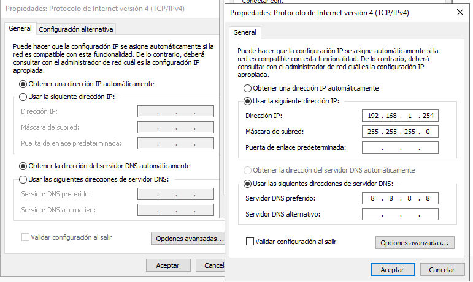
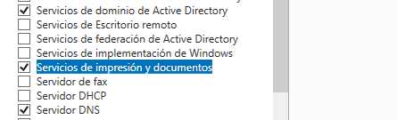
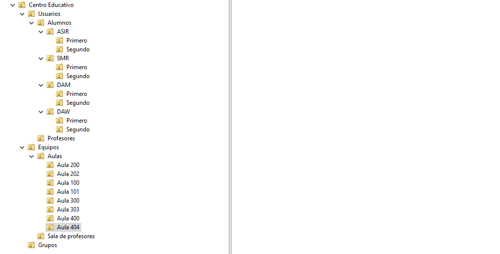
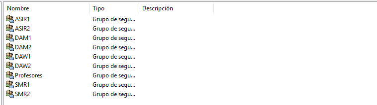

[Volver a inicio](../index.md)

A través del siguiente enlace podrá consultar las notas que he ido tomando para constituir este dominio educativo

[Notas](notas.md)

# Proyecto 2º Evaluación: Dominio Educativo  

## Villabalter.edu  

### Características del Servidor  

- **Nombre de equipo:** SRV-MSTR  
- **Dominio:** Villabalter.edu  
- **Sistema Operativo:** Windows Server 2019 (Datacenter)  
- **Tipo de Disco Duro:** NVMe (Partición GPT)  
- **Direcciones IP:**  
  - **Interfaz de internet:** DHCP (NAT)  
  - **Interfaz local:** 192.168.1.254  
- **Dirección MAC:** 00:50:56:38:2A:4B  
- **DNS:** Villabalter  
  - **DNS principal:** Servidor  
  - **DNS secundario:** 8.8.4.4 (Google)  

### Configuración Básica  

Como primer paso en la instalación y configuración de este dominio educativo, es necesario contar con una máquina Windows Server 2019.  

Los primeros pasos en esta configuración básica incluyen establecer el nombre del equipo y definir las direcciones IP:  

- **Nombre del equipo:** SRV-MSTR  
- **Interfaz de internet:** DHCP  
- **Interfaz de red local:** 192.168.1.0/24  
  - **IP del servidor:** 192.168.1.254/24  

  

### Alta Disponibilidad  

Para garantizar alta disponibilidad, se añadirá redundancia mediante un RAID-1 con dos discos NVMe, asegurando la integridad de los datos en caso de fallo de uno de los discos.  

### Instalación de Servicios  

Dado que este servidor actuará como controlador principal del dominio, es necesario instalar los siguientes roles:  

#### **Roles Instalados**  

- Servicios de Dominio de Active Directory  
- DNS  
- Servicios de Impresión y Documentos  

  

#### **Opciones del Controlador**  

- **Nombre del Bosque:** Villabalter.edu  
- **Nivel Funcional del Bosque y Dominio:** Windows Server 2016  
- **Contraseña:** Villabalter1 *(En un entorno real se recomienda una contraseña segura como:* **I36m}0":2?Zw** *)*  
- **Nombre de dominio NETBIOS:** VILLABALTER  
- **Carpetas:**  
  - **Base de datos:** C:\Windows\NTDS  
  - **Archivos de registro:** C:\Windows\NTDS  
  - **SYSVOL:** C:\Windows\SYSVOL  

### Servicio de Impresión  

Además de los roles mencionados, se instalará la característica de impresión para que los profesores puedan imprimir en red desde el aula.  

- **Impresora disponible:**  
  - **Nombre:** IMP-PROF  
  - **Dirección IP:** 192.168.1.230  

#### **Panel Web**  

*(Apuntar lo que contiene el panel web)*  

#### **Servicio LPD**  

Este servicio permitirá la impresión desde equipos UNIX (ya sean físicos o máquinas virtuales) que formen parte del dominio.  

El servidor desplegará la impresora compartida en toda la red.  

### Unidades Organizativas  

Se establecerá la siguiente estructura de Unidades Organizativas para mejorar la gestión del dominio:  

  

Una vez definidas las unidades organizativas, se procederá a la creación de los siguientes grupos dentro de sus respectivas UO:  

  

### Automatización  

Con la instalación y configuración del dominio finalizadas, se procederá a la automatización del alta de alumnos.  

El alta de usuarios se realizará utilizando un archivo **.csv** como referencia.  
