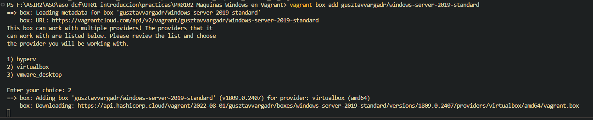
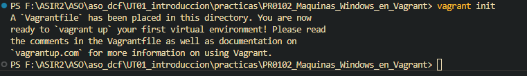
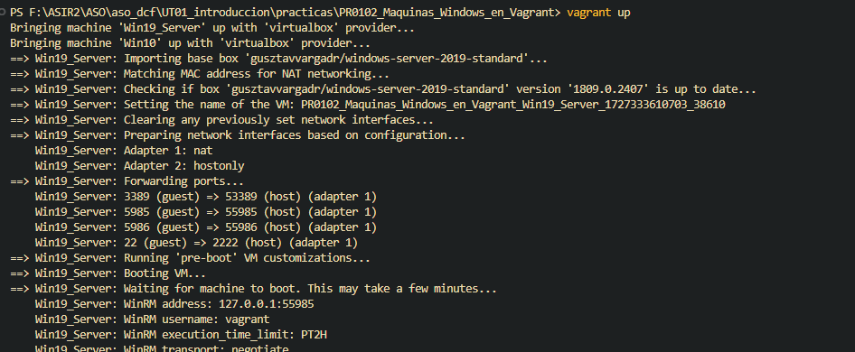
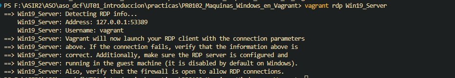
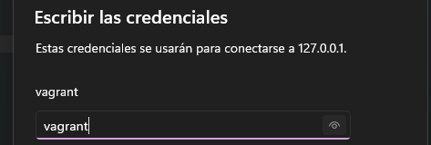
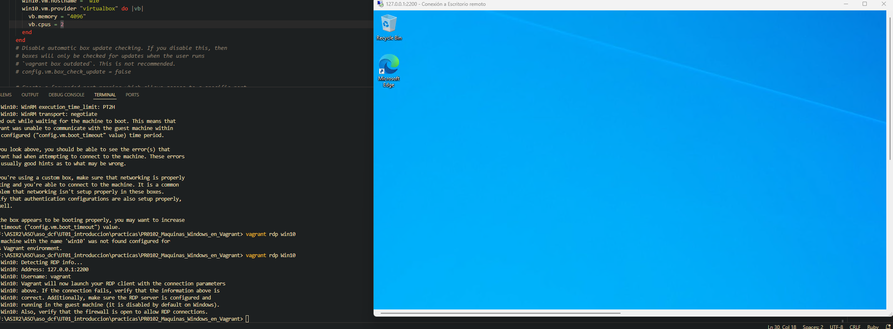
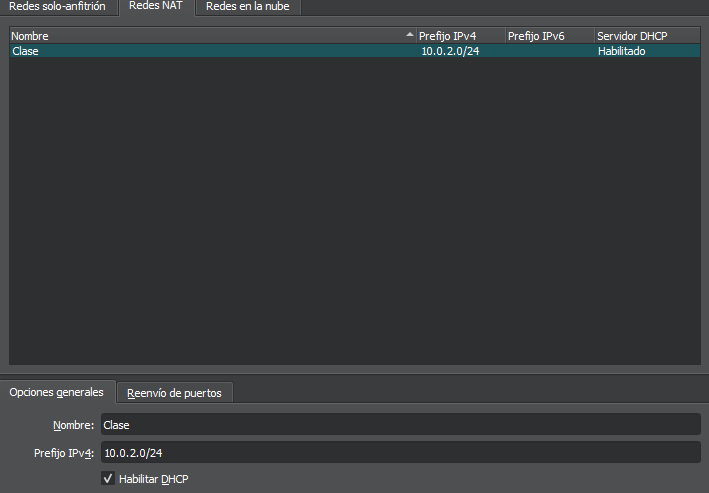
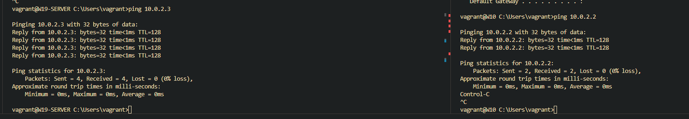

[Volver al indice](../../index.md)
# PR0102 - Máquinas Windows en Vagrant

## Obtener SO
Lo primero que debemos hacer es obtener los SO siguiente:

- Windows Server 2019 Standard
- Windows 10

Para ello vamos a descargar las máquinas de la siguiente forma:

>Los modelos escogidos son **gusztavvargadr/windows-server-2019-standard** y **gusztavvargadr/windows-10**

Con el comando:
 ```powershell
1. vagrant box add gusztavvargadr/windows-server-2019-standard
2. vagrant box add gusztavvargadr/windows-10
  ```

  Vamos a darnos cuenta que tardará un poco en descargar pero cuando lo tengamos podremos iniciar el **Vagrantfile**



## Preparación del Vagrantfile

Lo primero es iniciar con el comando ```vagrant init``` el vagrant en nuestro directorio. Esto hará que se genere el Vagrantfile que necesitamos.



> Si leemos la consola, vemos como ha generado el archivo Vagrantfile sin problema.


En este **Vagrantfile** necesitaremos configurar:
- Dos máquinas virtuales:
  - Windows Server 2019 Standard -> 4Gb de RAM y 4 cores
  - Windows 10 -> 2Gb de RAM y 2 cores
- Deberán de estar interconectadas entre sí
- Desde el host se podrá acceder a las maquinas a través de **RDP**


Como resultado de esta configuración tendríamos que tener algo parecido a lo siguiente:
```ruby
Vagrant.configure("2") do |config|

  config.vm.define "Win19_Server" do |winserver|
    winserver.vm.box = "gusztavvargadr/windows-server-2019-standard"
    winserver.vm.hostname = "w19-server"
    winserver.vm.network "private_network",ip: "172.16.0.2" netmask: "255.255.0.0"
    winserver.vm.provider "virtualbox" do |vb|
      vb.memory = "4096"
      vb.cpus = 4
    end
  end


  config.vm.define "Win10" do |win10|
    win10.vm.box = "gusztavvargadr/windows-10"
    win10.vm.hostname = "w10"
    win10.vm.network "private_network",ip: "172.16.0.3" netmask: "255.255.0.0"
    win10.vm.provider "virtualbox" do |vb|
      vb.memory = "4096"
      vb.cpus = 2
    end
  end
end
```


## RDP


Ahora que tenemos configurado el **vagrantfile**,iniciamos las maquinas




Cuando nos diga que está iniciada,nos conectaremos por RDP desde el host .

Para ello lo que tenemos que hacer es lo siguiente:

1. Primero escribir el comando ```vagrant rdp [nombre de la mv]```
  


2. Una vez hecho esto, tendremos que introducir las credenciales:
   1. Usuario: **vagrant**
   2. Contraseña: **vagrant**



3. Aceptar el cuadro de sincronización y **listo**.



## Conectividad entre MVs

Para que haya conectividad entre ambas maquinas he decidido crear una red NAT para las mvs.

Esto conseguirá que, además de tener interconexión entre ellas haya salida hacia internet.

Para ello nos vamos a VirtualBox y la creamos de la siguiente forma:


>

Una vez creada, vamos dentro del **Vagrantfile** y le asignamos las siguientes direcciones IP.

```ruby
        win10.vm.network "private_network",ip: "10.0.2.3", netmask: "255.255.255.0"
        winserver.vm.network "private_network",ip: "10.0.2.2", netmask: "255.255.255.0"
```

 Una vez hecho esto **desactivamos el firewall en ambas mvs**

Podemos utilizar el comando: ```netsh advfirewall set allprofiles state off```

Con esta configuración ambas máquinas y el host estarán en la red NAT que hemos creado.

Si hacemos un ping de Win10 a Win19_Server pues deberia de resultarnos algo como lo siguiente:


