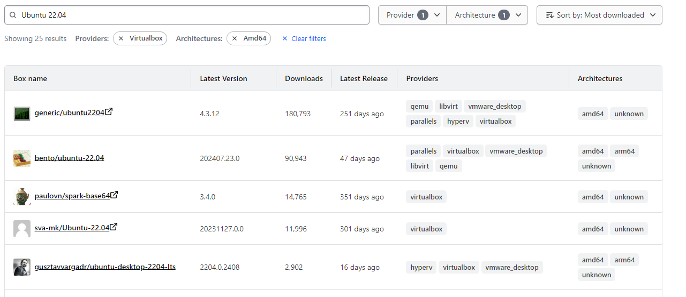
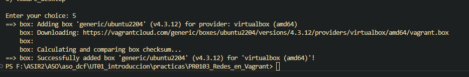
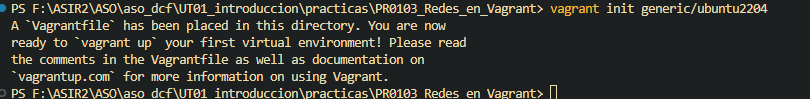

[Volver al indice](/UT01_introduccion/index.md)
# PR0103 : Redes en Vagrant

## Preparación de la máquina.
Vamos a utilizar una máquina virtual que no tenemos descargada en el equipo.

En cuestión descargaremos la versión de Ubuntu ***22.04***.Tras una búsqueda, hemos encontrado lo siguiente:



Vamos a elegir la máquina ***generic/ubuntu2204***, que es la que cuadra con los requisitos de la práctica.

Introduciremos los siguientes comandos en nuestra powershell:

```powershell
1. vagrant box add generic/ubuntu2204
2. vagrant init generic/ubuntu2204
```

Como resultado del primer comando nos tiene que aparecer algo similar a lo siguiente.




Introducimos el 2º comando que hemos indicado antes y nos aparecerá el vagrantfile de la máquina, el cual editaremos en el siguiente apartado



Ahora nos generará el vagrantfile que editaremos

## Edición de Vagrantfile

#### Ahora editaremos de la siguiente forma el archivo ***Vagrantfile***

La configuración que vamos a establecer en el Vagrantfile será la siguiente

```ruby
Vagrant.configure("2") do |config|
  config.vm.box = "generic/ubuntu2204"
  config.vm.hostname = "web-dcf"
  config.vm.provider "virtualbox" do |vb|
    vb.name = "Web Server"
    vb.memory = 3076
    vb.cpus = 2
  end

  config.vm.network "private_network", ip: "172.16.1.100", netmask: "255.255.0.0"  # Red privada
  config.vm.network "public_network", ip: "10.99.1.100", netmask: "255.255.0.0" # Red publica

  config.vm.network "forwarded_port", guest: 80, host: 8080  # Con esta opcion habilitamos ver la web en el host
  
   config.vm.provision "shell", inline: <<-SHELL
       apt-get update -y
       apt-get install -y apache2
  SHELL
end
```

Ahora que el ***Vagrantfile*** está editado de la siguiente manera, podremos iniciar la mv con el comando ```vagrant up ```

