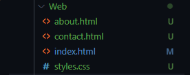

[Volver al indice](../../index.md)
# PR0103 : Redes en Vagrant

## Preparación de la máquina.
Vamos a utilizar una máquina virtual que no tenemos descargada en el equipo.

En cuestión descargaremos la versión de Ubuntu ***22.04***.Tras una búsqueda, hemos encontrado lo siguiente:


Vamos a elegir la máquina ***generic/ubuntu2204***, que es la que cuadra con los requisitos de la práctica.

Introduciremos los siguientes comandos en nuestra powershell:

```powershell
1. vagrant box add generic/ubuntu2204
2. vagrant init generic/ubuntu2204
```

Como resultado del primer comando nos tiene que aparecer algo similar a lo siguiente.


Introducimos el 2º comando que hemos indicado antes y nos aparecerá el vagrantfile de la máquina, el cual editaremos en el siguiente apartado


Ahora nos generará el vagrantfile que editaremos

## Edición de Vagrantfile

#### Ahora editaremos de la siguiente forma el archivo ***Vagrantfile***

La configuración que vamos a establecer en el Vagrantfile será la siguiente

```ruby
Vagrant.configure("2") do |config|
  config.vm.box = "generic/ubuntu2204"
  config.vm.hostname = "web-dcf"
  config.vm.provider "virtualbox" do |vb|
    vb.name = "Web Server"
    vb.memory = 3076
    vb.cpus = 2
  end

  config.vm.network "private_network", ip: "172.16.1.100", netmask: "255.255.0.0"  # Red privada
  config.vm.network "public_network", ip: "10.99.1.100", netmask: "255.255.0.0" # Red publica

  config.vm.network "forwarded_port", guest: 80, host: 8080  # Con esta opcion habilitamos ver la web en el host
  
   config.vm.provision "shell", inline: <<-SHELL
       apt-get update -y
       apt-get install -y apache2
  SHELL

  config.vm.synced_folder "Web/", "/var/www/html" #Carpeta compartida entre servidor y host
end
```

Ahora que el ***Vagrantfile*** está editado de la siguiente manera, podremos iniciar la mv con el comando ```vagrant up ```

Si introducimos el comando ```ip a``` nos apareceran todas las interfaces disponibles en nuestro equipo


> Como vemos en la imagen, a través del vagrantfile hemos configurado todas las interfaces sin tener que configurar directamente la MV


### Problemas con la conexion

Para evitar problemas con la conexion en la mv vamos a tener que hacer un ajuste al archivo **Vagranfile**

Realmente vamos a añadir lo siguiente:

> Lo meteremos dentro del scripting
```ruby
     echo "nameserver 8.8.8.8" | sudo tee /etc/resolv.conf > /dev/null
```

Nos tiene que quedar algo asi:


En el caso de que por defecto no arranque el script automaticamente tendremos que iniciarlo de forma manual ejecutando el comando ```vagrant provision```

Ahora ya tendremos todo listo.

## Configuración de la web


Crearemos un sitio web con tres paginas.

Necesitaremos dos archivos a parte del **index.html**

1. about.html
2. contact.html

Seguido de esto le he añadido una hoja de estilos

1. styles.css

> Este sería el contenido de la pagina web



### Código de la web

1. [index.html](Web/index.html)
2. [about.html](Web/about.html)
3. [contact.html](Web/contact.html)
4. [Hoja de estilos](Web/styles.css)


### Confirmación carpeta compartida

Para comprobar que tenemos las carpetas sincronizadas haremos lo que se ha hecho en la siguiente captura.


### Visualización web

Ahora en el host abrimos el navegador y escribimos la dirección IP del servidor WEB
> Vemos como ha funcionado perfectamente.

