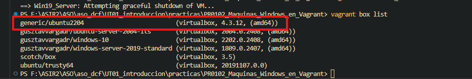
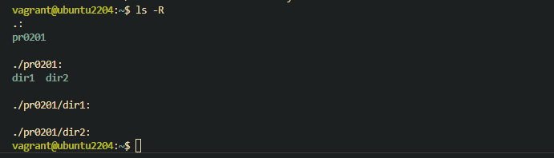
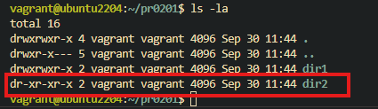

[Volver al indice de la unidad](../../index.md)

# PR0201: Usuarios y permisos

## Preparación

Lo primero que necesitamos es la mv. En concreto es la **generic/ubuntu2204**

Con el comando ```vagrant box list``` comprobaremos si tenemos la máquina en nuestro host.



Como si la tenemos, iniciamos el directorio con vagrant con el comando ```vagrant init generic/ubuntu2204```.

Comprobamos con un ```dir``` vermos que ha aparecido el directorio **.vagrant**

Iniciamos la máquina con el comandon ```vagrant up```

## Permisos de usuarios

Una vez dentro nos tenemos que situar dentro del directorio personal del usuario.

### 1. Crear directorios

- Crear directorio **pr0201** dentro del directorio personal
- Crear directorios **dir1** y **dir2** dentro de **pr0201**
- Verificar permisos de **dir1** (Sin captura, únicamente explicación)

Para crear un directorio en linux tenemos que utilizar el comando ```mkdir [nombre de directorio]```.

Los creamos y nos tendría que quedar el árbol de directorios de la siguiente forma:



#### Permisos del directorio dir1

El directorio dir1 tiene los permisos de: "**drwxrwxr-x**"

- "d" -> Ya que es un directorio
- "rwx" -> Control total del usuario **vagrant**
- "rwx" -> Control total del grupo **vagrant**
- "r-x" -> Lectura y ejecución de otros usuarios
- La propiedad del directorio la tiene el usuario **vagrant**
- La propuedad del archivo la tiene el grupo **vagrant**


### 2. Eliminar permisos dir2 con notación simbólica

Para eliminar los permisos de escritura del dir2 utilizando notación simbólica tendremos que introducir el siguiente comando:

```bash
chmod a-w dir2/
```

Este comando significa lo siguiente:
- **chmod** : Cambiar permisos archivo/directorio
- **-w** : Quitar permiso de escritura
- **a** : Engloba todos los usuarios 
- **dir2/** : Directorio en el cual va a hacer efecto el cambio

Resultado si hacemos un ```ls -la```,veremos el resultado de ejecutar el comando.




### 3. Eliminar permisos dir2 utilizando notación octal.

Eliminaremos del **dir2** el permiso de lectura en el resto de los usuarios.

Para ello tenemos que utilizar el siguiente comando:

```bash
chmod 
```