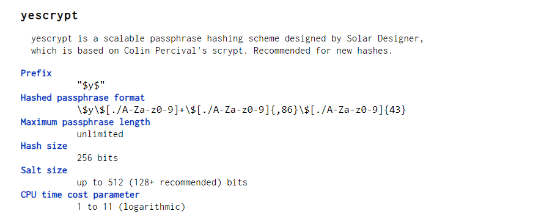

[Volver al indice de la unidad](../../index.md)

# PR0201: Usuarios y permisos

## Preparación

Lo primero que necesitamos es la mv. En concreto es la **generic/ubuntu2204**

Con el comando ```vagrant box list``` comprobaremos si tenemos la máquina en nuestro host.


Como si la tenemos, iniciamos el directorio con vagrant con el comando ```vagrant init generic/ubuntu2204```.

Comprobamos con un ```dir``` vermos que ha aparecido el directorio **.vagrant**

Iniciamos la máquina con el comandon ```vagrant up```

---

## Permisos de usuarios

Una vez dentro nos tenemos que situar dentro del directorio personal del usuario.

### 1. Crear directorios

- Crear directorio **pr0201** dentro del directorio personal
- Crear directorios **dir1** y **dir2** dentro de **pr0201**
- Verificar permisos de **dir1** (Sin captura, únicamente explicación)

Para crear un directorio en linux tenemos que utilizar el comando ```mkdir [nombre de directorio]```.

Los creamos y nos tendría que quedar el árbol de directorios de la siguiente forma:


#### Permisos del directorio dir1

El directorio dir1 tiene los permisos de: "**drwxrwxr-x**"

- "d" -> Ya que es un directorio
- "rwx" -> Control total del usuario **vagrant**
- "rwx" -> Control total del grupo **vagrant**
- "r-x" -> Lectura y ejecución de otros usuarios
- La propiedad del directorio la tiene el usuario **vagrant**
- La propuedad del archivo la tiene el grupo **vagrant**


### 2. Eliminar permisos dir2 con notación simbólica

Para eliminar los permisos de escritura del dir2 utilizando notación simbólica tendremos que introducir el siguiente comando:

```bash
chmod a-w dir2/
```

Este comando significa lo siguiente:
- **chmod** : Cambiar permisos archivo/directorio
- **-w** : Quitar permiso de escritura
- **a** : Engloba todos los usuarios 
- **dir2/** : Directorio en el cual va a hacer efecto el cambio

Resultado si hacemos un ```ls -la```,veremos el resultado de ejecutar el comando.


### 3. Eliminar permisos dir2 utilizando notación octal.

Eliminaremos del **dir2** el permiso de lectura en el resto de los usuarios.

Para ello tenemos que utilizar el siguiente comando:

```bash
chmod 550 dir2/
```


### 4. ¿Cuáles son los permisos de dir2?

Los permisos de la carpeta quedarán siendo : ```dr-xr-x--- 2 vagrant vagrant 4096 Sep 30 11:44 dir2```

### 5. Crear bajo dir2 una carpeta llamada dir21

Para crear una carpeta dentro de dir2 haremos lo siguiente:

```bash
cd dir2/
mkdir dir21
```

El output del comando : ```mkdir: cannot create directory ‘dir21’: Permission denied``` . No tenemos el permiso para crear nada dentro del directorio

Para conseguir crear la carpeta nos iremos al paso **6**

### 6. Concederme el permiso de escritura en la carpeta creada

Teniendo en cuenta que el propietario del directorio somos nosotros,para devolver los permisos de escritura a la carpeta ,haremos lo siguiente.

```bash
chmod u+w dir2
```
El output será el siguiente: ```drwxr-x--- 2 vagrant vagrant 4096 Sep 30 11:44 dir2```.

Ahora intentamos de nuevo la creacion de la carpeta **dir21** y no nos debería limitar.

```bash
vagrant@ubuntu2204:~/pr0201$ mkdir dir2/dir21
vagrant@ubuntu2204:~/pr0201$ ls dir2/
dir21
```
---

## Notación simbólica y octal

Nos iremos a la raíz de la carpeta personal y crearemos un fichero llamado **notacion.txt**.Tendrá los permisos "rw-r--r--".

Ahora haremos el cambio de los permisos a los siguientes:

#### NOTA: EN VEZ DE PASAR DEL INICIAL A CADA UNO, HE IDO DE UNO A OTRO (DE FORMA ENCADENADA. EL PRIMERO CON EL SEGUNDO, EL SEGUNDO CON EL TERCERO....ETC)

- rwxrwxr-x : ```chmod u+x,g+wx,o+w notacion.txt``` **->** ```-rwxrwxrw- 1 vagrant vagrant    1 Oct  1 06:57 notacion.txt```
- rwxr--r-- : ```chmod g-wx,o-wx notacion.txt ``` **->** ```-rwxr--r-- 1 vagrant vagrant    1 Oct  1 06:57 notacion.txt```
- r--r----- : ```chmod u-wx,o-r notacion.txt ``` **->** ```-r--r----- 1 vagrant vagrant    1 Oct  1 06:57 notacion.txt```
- rwxr-xr-x : ```chmod u+wx,g+x,o+xr notacion.txt``` **->** ```-rwxr-xr-x 1 vagrant vagrant    1 Oct  1 06:57 notacion.txt```
- r-x--x--x : ```chmod u-w,g-rw,o-r notacion.txt ``` **->** ```-r-x--x--x 1 vagrant vagrant    1 Oct  1 06:57 notacion.txt```
- -w-r----x : ```chmod u-rx,u+w,g-x,g+r notacion.txt``` **->** ```--w-r----x 1 vagrant vagrant    1 Oct  1 06:57 notacion.txt```
- -----xrwx : ```chmod u-w,g-r,g+x,o+rw notacion.txt ``` **->** ```------xrwx 1 vagrant vagrant    1 Oct  1 06:57 notacion.txt```
- r---w---x : ```chmod u+r,g+w,g-x,o-rw notacion.txt ``` **->** ```-r---w---x 1 vagrant vagrant    1 Oct  1 06:57 notacion.txt```
- -w------- : ```chmod u-r,u+w,g-w,o-x notacion.txt ``` **->** ```--w------- 1 vagrant vagrant    1 Oct  1 06:57 notacion.txt```
- rw-r----- : ```chmod u+r,g+r notacion.txt``` **->** ```-rw-r----- 1 vagrant vagrant    1 Oct  1 06:57 notacion.txt```
- rwx--x--x : ```chmod u+x,g-r,g+x,o+x notacion.txt ``` **->** ```-rwx--x--x 1 vagrant vagrant    1 Oct  1 06:57 notacion.txt```


Ahora haremos el cambio de los permisos del archivo a las siguientes en forma **octal**

> Permisos del archivo notacion.txt iniciales: "rw-r--r--"

#### ESTA HECHO COMO MANDA EL EJERCICIO.
- rwxrwxrwx : ```chmod 777 notacion.txt``` **->** ```-rwxrwxrwx 1 vagrant vagrant    1 Oct  1 06:57 notacion.txt```
- --x--x--x : ```chmod 111 notacion.txt ``` **->** ```---x--x--x 1 vagrant vagrant    1 Oct  1 06:57 notacion.txt```
- r---w---x : ```chmod 421 notacion.txt ``` **->** ```-r---w---x 1 vagrant vagrant    1 Oct  1 06:57 notacion.txt```
- -w------- : ```chmod 200 notacion.txt``` **->** ```--w------- 1 vagrant vagrant    1 Oct  1 06:57 notacion.txt```
- rw-r----- : ```chmod 640 notacion.txt ``` **->** ```-rw-r----- 1 vagrant vagrant    1 Oct  1 06:57 notacion.txt```
- rwx--x--x : ```chmod 711 notacion.txt ``` **->** ```-rwx--x--x 1 vagrant vagrant    1 Oct  1 06:57 notacion.txt```
- rwxr-xr-x : ```chmod 755 notacion.txt``` **->** ```-rwxr-xr-x 1 vagrant vagrant    1 Oct  1 06:57 notacion.txt```
- r-x--x--x : ```chmod 511 notacion.txt ``` **->** ```-r-x--x--x 1 vagrant vagrant    1 Oct  1 06:57 notacion.txt```
- -w-r----x : ```chmod 241 notacion.txt ``` **->** ```--w-r----x 1 vagrant vagrant    1 Oct  1 06:57 notacion.txt```
- -----xrwx : ```chmod 017 notacion.txt``` **->** ```------xrwx 1 vagrant vagrant    1 Oct  1 06:57 notacion.txt```

---

## El bit sigd

### 1. Creacuón de grupo y usuarios.

Vamos a crear un grupo llamado **asir** y crearemos dos usuarios con mis iniciales que pertenezcan a ese grupo.

Para ello vamos con la creación del grupo:

```bash
sudo groupadd asir
```

Y a continuación con los usuarios y su respectiva inclusión en el grupo.

```bash
sudo useradd -g asir dcf1
sudo useradd -g asir dcf2

vagrant@ubuntu2204:~$ groups dcf1
dcf1 : asir

vagrant@ubuntu2204:~$ groups dcf2
dcf2 : asir

```


### 2. Creación de directorio y asignación de propietario

Vamos a crear en la raíz del usuario vagrant un directorio llamado **compartido**.

Tendrá como propietarios:

- Usuario : **root**
- Grupo : **asir**

Ejecución de comandos:

```bash 
vagrant@ubuntu2204:~$ mkdir compartido
vagrant@ubuntu2204:~$ chown root:asir compartido/
chown: changing ownership of 'compartido/': Operation not permitted

#NECESITO TENER PRIVILEGIOS DE ADMINISTRADOR PARA ASIGNAR LOS PROPIETARIOS DEL DIRECTORIO

vagrant@ubuntu2204:~$ sudo chown root:asir compartido/
```

### 3. Asignación de permisos al directorio

Le asignaremos los permisos exclusivamente al usuario propietario del directorio y al grupo.

Para ello utilizaremos el comando:

```bash
vagrant@ubuntu2204:~$ chmod 770 notacion.txt 
vagrant@ubuntu2204:~$ chmod o-rx compartido/
chmod: changing permissions of 'compartido/': Operation not permitted

#utilizar el sudo para revocar los permisos de lectura y escritura de los otros usuarios

vagrant@ubuntu2204:~$ sudo chmod o-rx compartido/

#Resultado:
drwxrwx--- 2 root    asir    4096 Oct  1 07:58 compartido
```

### 4. Añadir el bit setgid al directorio "compartido/"

Añadiremos con el siguiente comando el bit setgid:

```bash
vagrant@ubuntu2204:~$ sudo chmod g+s compartido/
drwxrws--- 2 root    asir    4096 Oct  1 07:58 compartido
```

### 5. Inicio de sesión con dcf1 y creación de archivo

Los primero que tenemos que hacer es : ```sudo su dcf1``` para asi cambiar al usuario1. En el momento que nosotros hemos iniciado sesión con este usuario nos daremos cuenta que, no tiene ni contraseña ni terminal asignada.Por lo que vamos a añadirserlas

```bash
vagrant@ubuntu2204:~$ sudo passwd dcf1
New password: 
Retype new password:
passwd: password updated successfully

vagrant@ubuntu2204:~$ sudo passwd dcf2
New password: 
Retype new password:
passwd: password updated successfully

vagrant@ubuntu2204:~$ sudo usermod -s /bin/bash dcf1 
vagrant@ubuntu2204:~$ sudo usermod -s /bin/bash dcf2

vagrant@ubuntu2204:/$ sudo chmod 770 compartido/
```

Ahora ya cuando queramos cambiar tenemos los usuarios con contraseña y terminal.

Iniciamos sesión con el usuario1 y procederemos a crear el archivo.Una vez hecho comprobamos sus permisos

```bash
vagrant@ubuntu2204:/$ su dcf1
Password: 
dcf1@ubuntu2204:/$ cd compartido/
dcf1@ubuntu2204:/compartido$ echo "hola" > fichero1.txt
dcf1@ubuntu2204:/compartido$ ls -l
-rw-r--r-- 1 dcf1 asir 5 Oct  1 10:55 fichero1.txt
```
Como vemos tenemos los siguientes permisos en fichero1.txt
- Usuario : Lectura y escritura
- Grupo : Lectura
- Otros : Lectura


### 6. Inicio de sesión con usuario2 y añadirle contenido

Ahora iniciaremos sesión con dcf2 y añadiremos contenido al fichero que hemos creado con dcf1

```bash
vagrant@ubuntu2204:/$ su dcf2
Password: 
dcf2@ubuntu2204:/$ cd compartido/
dcf2@ubuntu2204:/compartido$ echo "Bon dia a todos" > fichero1.txt 
bash: fichero1.txt: Permission denied
dcf2@ubuntu2204:/compartido$

dcf2@ubuntu2204:/compartido$ ls -l
total 4
-rw-r--r-- 1 dcf1 asir 5 Oct  1 10:55 fichero1.txt
dcf2@ubuntu2204:/compartido$ 
```

Como vemos en el codigo de arriba no nos permite escribir en el fichero1 que tiene como propietario dcf1.
> Como se ve en el codigo los otros usuarios solo podrán leer el contenido del archivo.


### 7. Preguntas

1. ¿Qué ventajas tiene usar el bit setgid en entornos colaborativos?

    Nos permite que todos los usuarios pertenecientes al grupo propietario del directorio principal podrá interactuar con los archivos y carpetas que contengan.

2. ¿Qué sucede si no se aplica el bit setgid en un entorno colaborativo?

    Puede provocar problemas de acceso a contenidos y a archivos.


### 8. Eliminación de usuarios y directorios.

Primero eliminaremos los usuarios **dcf1** y **dcf2**
```bash
vagrant@ubuntu2204:~$ sudo userdel dcf1
vagrant@ubuntu2204:~$ sudo userdel dcf2
```


Y por último las carpetas y archivos.

```bash
vagrant@ubuntu2204:/$ sudo rm -rf compartido/
```

---

## Sticky bit

### 1. Creación de carpeta "compartido/"

Crearemos la carpeta "compartido" en la raiz de nuestro sistema

```bash
 sudo mkdir compartido
```

A esta carpeta le daremos los permisos a todos los usuarios

```bash
ls -l | grep "compartido"
drwxr-xr-x   2 root root       4096 Oct  3 06:59 compartido
```

### 2. Creación usuario1 y usuario2

Para crear ambos usuarios escribimos lo siguiente:

```bash
vagrant@ubuntu2204:/$ sudo useradd -s /bin/bash dcf1
vagrant@ubuntu2204:/$ sudo useradd -s /bin/bash dcf2
vagrant@ubuntu2204:/$ sudo passwd dcf1
New password: 
Retype new password:
passwd: password updated successfully
vagrant@ubuntu2204:/$ sudo passwd dcf2
New password: 
Retype new password:
passwd: password updated successfully
vagrant@ubuntu2204:/$ 
```

### 3. Pruebas con usuarios

Iniciaremos con dcf1, crearemos un fichero y con dcf2 intentaremos borrarlo

```bash

vagrant@ubuntu2204:/$ su dcf1
Password: 
dcf1@ubuntu2204:/$ cd compartido/
dcf1@ubuntu2204:/compartido$ echo "" > fichero1.txt
dcf1@ubuntu2204:/compartido$ exit
exit
vagrant@ubuntu2204:/$ su dcf2
Password:
dcf2@ubuntu2204:/$ cd compartido/
dcf2@ubuntu2204:/compartido$ rm fichero1.txt 
rm: remove write-protected regular file 'fichero1.txt'?
dcf2@ubuntu2204:/compartido$ ls -l
total 4
-rw-rw-r-- 1 dcf1 dcf1 1 Oct  3 07:05 fichero1.txt
dcf2@ubuntu2204:/compartido$ rm fichero1.txt 
rm: remove write-protected regular file 'fichero1.txt'? yes
dcf2@ubuntu2204:/compartido$ ls -l
total 0
dcf2@ubuntu2204:/compartido$

```

### 4. Establecemos el sticky bit en el directorio "compartido"

Nos iremos al directorio raíz y le asignaremos el permiso de **sticky bit**

```bash
vagrant@ubuntu2204:/$ sudo chmod +t compartido/
vagrant@ubuntu2204:/$ ls -l | grep "compartido"
drwxrwxrwt   2 root root       4096 Oct  3 07:05 compartido
vagrant@ubuntu2204:/$
```

### 5. Intento de borrado de fichero creado por dcf1

Ahora repetimos lo mismo iniciamos sesion con el dcf1 creamos el archivo y intentamos borrarlo con dcf2

```bash
vagrant@ubuntu2204:/$ su dcf1
Password:
dcf1@ubuntu2204:/$ cd compartido/
dcf1@ubuntu2204:/compartido$ echo "" > fichero1.txt
dcf1@ubuntu2204:/compartido$ exit
exit
vagrant@ubuntu2204:/$ su dcf2
Password:
dcf2@ubuntu2204:/$ cd compartido/
dcf2@ubuntu2204:/compartido$ rm fichero1.txt 
rm: remove write-protected regular file 'fichero1.txt'? yes
rm: cannot remove 'fichero1.txt': Operation not permitted
dcf2@ubuntu2204:/compartido$
```

### 6. Preguntas

1. ¿Qué efecto tiene el sticky bit en un directorio?

    Como vemos por culpa del sticky bit nos prohibe eliminar el archivo que creó **dcf1**

2. Si tienes habilitado el sticky bit, ¿cómo tendrías que hacer para eliminar un fichero dentro del directorio?

    Tendría que ser el propietario el responsable de eliminar el archivo.


## Fichero etc/shadow

> IMPORTANTE: Tendremos que utilizar la imagen de mv : **generic/ubuntu2204**

### 1. Creación de Usuario

Como primer paso, crearemos el usuario con nuestras iniciales y de contraseña **asir2**.Estos son los comandos para la creación del usuario:

```bash
vagrant@ubuntu2204:~$ sudo passwd dcf
New password: 
Retype new password:
passwd: password updated successfully
vagrant@ubuntu2204:~$
```

### 2. Mostrar linea en etc/shadow

Ahora mostraremos con el siguiente comando la linea de nuestro usuario dentro del archivo **etc/shadow**

```bash
vagrant@ubuntu2204:~$ sudo cat /etc/shadow | grep "dcf"
dcf:$y$j9T$PytXdYrHjsUTwsSBe9BSO.$S14sK5WKdHXoD0DcZY2tC5BY55pK80af1LygVS2cjW8:20003:0:99999:7:::
```

### 3. Tipos de hashes

Las contraseñas se guardan en este archivo de manera encriptada. Suele utilizar los siguientes protocolos:

- $1$ – MD5
- $2a$ – Blowfish
- $2y$ – Eksblowfish
- $5$ – SHA-256
- $6$ – SHA-512

> Estos métodos de hashes los he encontrado en el apartado dos del temario: $Ficheros /etc/passwd /etc/shadow y /etc/group en GNU/Linuxç$

Si nos fijamos en nuestra contraseña, no pertenece a ninguna de las que tenemos apuntadas. La contraseña nuestra empieza por una y rodeada de dos simbolos de dollar.

### 4. Hash de nuestras contraseñas

Como en nuestro caso empieza por una manera distinta a las indicadas en el paso anterior, he decidido buscar que tipo de hash es.

He descubierto a traves de la [documentación oficial de Debian](https://manpages.debian.org/unstable/libcrypt-dev/crypt.5.en.html), que tipo de hash es.

En cuestión es **yescrypt**.



> Después de llegar aquí he revisado el temario y sí aparecia el yescrypt, pero en otro apartado, aparecia en $Understanding /etc/shadow file format on Linux$ 

