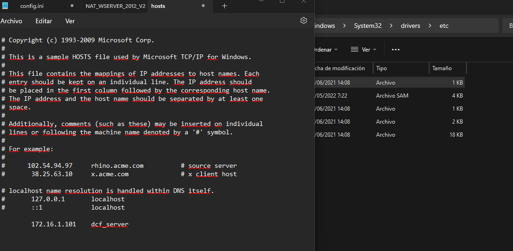

<<<<<<< HEAD
[Volver al indice de la unidad](../../index.md)

# PR0202 : Conexión SSH

## Preparación de mv y configuración de red

### 1. Añadir interfaz host only

Para añadir la interfaz host-only en la mv en vagrant, tenemos que añadir al **vagrantfile** lo siguiente:

> La opción **hostonly: true** nos permite tener la conexión **solo-anfitrión**

```ruby
Vagrant.configure("2") do |config|
  config.vm.box = "generic/ubuntu2204"
  config.vm.network "forwarded_port", guest: 80, host: 8080
  config.vm.network "private_network", ip: "192.168.56.10", 
    hostonly: true
end
```

### 2. Direcciones IP asignadas.

Las direcciones ip asignadas a los equipos son:

1. Dirección asignada a mv

```bash
3: eth1: <BROADCAST,MULTICAST,UP,LOWER_UP> mtu 1500 qdisc fq_codel state UP group default qlen 1000
    link/ether 08:00:27:d3:17:85 brd ff:ff:ff:ff:ff:ff
    altname enp0s8
    inet 172.16.1.101/24 brd 172.16.1.255 scope global eth1
       valid_lft forever preferred_lft forever
    inet6 fe80::a00:27ff:fed3:1785/64 scope link
       valid_lft forever preferred_lft forever
```

2. Dirección asignada en host

```powershell
Adaptador de Ethernet Ethernet 6:

   Sufijo DNS específico para la conexión. . :
   Vínculo: dirección IPv6 local. . . : fe80::e8c0:19ef:1ffe:2dad%43
   Dirección IPv4. . . . . . . . . . . . . . : 172.16.1.1
   M√°scara de subred . . . . . . . . . . . . : 255.255.255.0
   Puerta de enlace predeterminada . . . . . :
```

### 3. Conexión MV - HOST

Para comprobar que tengo conexión entre ellos dos ,haremos un ping.

```bash
vagrant@ubuntu2204:~$ ping 172.16.1.1
PING 172.16.1.1 (172.16.1.1) 56(84) bytes of data.
64 bytes from 172.16.1.1: icmp_seq=1 ttl=128 time=2.35 ms
^C
--- 172.16.1.1 ping statistics ---
1 packets transmitted, 1 received, 0% packet loss, time 0ms
rtt min/avg/max/mdev = 2.348/2.348/2.348/0.000 ms
```

### 4. Cambio de hostname - MV

Para cambiar de manera permanente el **hostname** de la mv tenemos que introducir el siguiente comando:

```bash
vagrant@ubuntu2204:~$ sudo hostnamectl set-hostname dcf_server
```

### 5. Host resolviendo MV-Hostname

Si queremos que nuestro host resuelva el hostname de nuetra mv tenemos que editar un archivo que se encuentra en el archivo **hosts**.

Este archivo se localiza en la siguiente dirección:

```powershell
C:\Windows\System32\drivers\etc\hosts
```



Ahora probaremos que el host resuelve el nombre de nuestro servidor.

```powershell
PS F:\ASIR2\ASO\aso_dcf> ping dcfserver

Haciendo ping a dcfserver [172.16.1.101] con 32 bytes de datos:
Respuesta desde 172.16.1.101: bytes=32 tiempo=2ms TTL=64
Respuesta desde 172.16.1.101: bytes=32 tiempo<1m TTL=64
```

---

## Creación usuario y conexión SSH

### 1. Creación usuario ssh

Crearemos dentro de la mv el siguiente usuario

```bash
vagrant@dcfserver:~$ sudo useradd -s /bin/bash dcf_ssh 
vagrant@dcfserver:~$ sudo passwd dcf_ssh
New password: 
Retype new password:
passwd: password updated successfully
vagrant@dcfserver:~$
```

### 2. Conexión con contraseña

Para conectarnos con ssh a la mv tenemos que introducir lo siguiente en nuestro host:

```powershell
ssh dcf_ssh@dcfserver 
The authenticity of host 'dcfserver (172.16.1.101)' can't be established.
ED25519 key fingerprint is SHA256:8jb9PJTRFRqHN+Zj3UdWFmUixnU13vC2Bm6BIApNs8A.
This key is not known by any other names
Are you sure you want to continue connecting (yes/no/[fingerprint])? yes
Warning: Permanently added 'dcfserver' (ED25519) to the list of known hosts.
dcf_ssh@dcfserver's password: 
```

### 3. Conexión SCP

Para realizar la conexión scp lo primero que tenemos que hacer es generar en nuestro windows un par de claves

```powershell
F:\ASIR2\ASO\aso_dcf\UT02_Instalacion_y_puesta_en_marcha_Linux_Server\Practicas\UT0202_Conexion_SSH\claves>ssh-keygen
Generating public/private rsa key pair.
Enter file in which to save the key (C:\Users\Alumno/.ssh/id_rsa):
Enter passphrase (empty for no passphrase):
Enter same passphrase again:
Your identification has been saved in C:\Users\Alumno/.ssh/id_rsa
Your public key has been saved in C:\Users\Alumno/.ssh/id_rsa.pub
The key fingerprint is:
SHA256:2zKjmgRGfCXZL6rS8irAzAf8qbHaQx1yJ2hQL+qmISs alumno@ED24016481P059
The key's randomart image is:
+---[RSA 3072]----+
| .. .o.          |
|.. ..o.          |
|..+.o  .         |
| =+o+ o .        |
|=.=+.= .S        |
|o*.=o    o       |
|+==..   = .      |
|E*+. . . +       |
|O=o.o..          |
+----[SHA256]-----+

F:\ASIR2\ASO\aso_dcf\UT02_Instalacion_y_puesta_en_marcha_Linux_Server\Practicas\UT0202_Conexion_SSH\claves>
```

Una vez que le pasemos al servidor de ubuntu la clave y la guardemos en el directorio del usuario que hemos creado, si nos conectamos por ssh desde el host veremos como autentica a través de la clave sin hacer falta añadir contraseña.


```powershell
C:\Users\Alumno>ssh dcfserver
alumno@dcfserver's password:

C:\Users\Alumno>ssh dcf_ssh@dcfserver
Enter passphrase for key 'C:\Users\Alumno/.ssh/id_rsa':
Enter passphrase for key 'C:\Users\Alumno/.ssh/id_rsa':

The programs included with the Ubuntu system are free software;
the exact distribution terms for each program are described in the
individual files in /usr/share/doc/*/copyright.

Ubuntu comes with ABSOLUTELY NO WARRANTY, to the extent permitted by
applicable law.

dcf_ssh@dcfserver:~$
```
=======
ˇˇˇˇˇˇˇˇˇˇˇˇˇˇˇˇˇˇˇˇˇˇˇˇˇˇˇˇˇˇˇˇˇˇˇˇˇˇˇˇˇˇˇˇˇˇˇˇˇˇˇˇˇˇˇˇˇˇˇˇˇˇˇˇˇˇˇˇˇˇˇˇˇˇˇˇˇˇˇˇˇˇˇˇˇˇˇˇˇˇˇˇˇˇˇˇˇˇˇˇˇˇˇˇˇˇˇˇˇˇˇˇˇˇˇˇˇˇˇˇˇˇˇˇˇˇˇˇˇˇˇˇˇˇˇˇˇˇˇˇˇˇˇˇˇˇˇˇˇˇˇˇˇˇˇˇˇˇˇˇˇˇˇˇˇˇˇˇˇˇˇˇˇˇˇˇˇˇˇˇˇˇˇˇˇˇˇˇˇˇˇˇˇˇˇˇˇˇˇˇˇˇˇˇˇˇˇˇˇˇˇˇˇˇˇˇˇˇˇˇˇˇˇˇˇˇˇˇˇˇˇˇˇˇˇˇˇˇˇˇˇˇˇˇˇˇˇˇˇˇˇˇˇˇˇˇˇˇˇˇˇˇˇˇˇˇˇˇˇˇˇˇˇˇˇˇˇˇˇˇˇˇˇˇˇˇˇˇˇˇˇˇˇˇˇˇˇˇˇˇˇˇˇˇˇˇˇˇˇˇˇˇˇˇˇˇˇˇˇˇˇˇˇˇˇˇˇˇˇˇˇˇˇˇˇˇˇˇˇˇˇˇˇˇˇˇˇˇˇˇˇˇˇˇˇˇˇˇˇˇˇˇˇˇˇˇˇˇˇˇˇˇˇˇˇˇˇˇˇˇˇˇˇˇˇˇˇˇˇˇˇˇˇˇˇˇˇˇˇˇˇˇˇˇˇˇˇˇˇˇˇˇˇˇˇˇˇˇˇˇˇˇˇˇˇˇˇˇˇˇˇˇˇˇˇˇˇˇˇˇˇˇˇˇˇˇˇˇˇˇˇˇˇˇˇˇˇˇˇˇˇˇˇˇˇˇˇˇˇˇˇˇˇˇˇˇˇˇˇˇˇˇˇˇˇˇˇˇˇˇˇˇˇˇˇˇˇˇˇˇˇˇˇˇˇˇˇˇˇˇˇˇˇˇˇˇˇˇˇˇˇˇˇˇˇˇˇˇˇˇˇˇˇˇˇˇˇˇˇˇˇˇˇˇˇˇˇˇˇˇˇˇˇˇˇˇˇˇˇˇˇˇˇˇˇˇˇˇˇˇˇˇˇˇˇˇˇˇˇˇˇˇˇˇˇˇˇˇˇˇˇˇˇˇˇˇˇˇˇˇˇˇˇˇˇˇˇˇˇˇˇˇˇˇˇˇˇˇˇˇˇˇˇˇˇˇˇˇˇˇˇˇˇˇˇˇˇˇˇˇˇˇˇˇˇˇˇˇˇˇˇˇˇˇˇˇˇˇˇˇˇˇˇˇˇˇˇˇˇˇˇˇˇˇˇˇˇˇˇˇˇˇˇˇˇˇˇˇˇˇˇˇˇˇˇˇˇˇˇˇˇˇˇˇˇˇˇˇˇˇˇˇˇˇˇˇˇˇˇˇˇˇˇˇˇˇˇˇˇˇˇˇˇˇˇˇˇˇˇˇˇˇˇˇˇˇˇˇˇˇˇˇˇˇˇˇˇˇˇˇˇˇˇˇˇˇˇˇˇˇˇˇˇˇˇˇˇˇˇˇˇˇˇˇˇˇˇˇˇˇˇˇˇˇˇˇˇˇˇˇˇˇˇˇˇˇˇˇˇˇˇˇˇˇˇˇˇˇˇˇˇˇˇˇˇˇˇˇˇˇˇˇˇˇˇˇˇˇˇˇˇˇˇˇˇˇˇˇˇˇˇˇˇˇˇˇˇˇˇˇˇˇˇˇˇˇˇˇˇˇˇˇˇˇˇˇˇˇˇˇˇˇˇˇˇˇˇˇˇˇˇˇˇˇˇˇˇˇˇˇˇˇˇˇˇˇˇˇˇˇˇˇˇˇˇˇˇˇˇˇˇˇˇˇˇˇˇˇˇˇˇˇˇˇˇˇˇˇˇˇˇˇˇˇˇˇˇˇˇˇˇˇˇˇˇˇˇˇˇˇˇˇˇˇˇˇˇˇˇˇˇˇˇˇˇˇˇˇˇˇˇˇˇˇˇˇˇˇˇˇˇˇˇˇˇˇˇˇˇˇˇˇˇˇˇˇˇˇˇˇˇˇˇˇˇˇˇˇˇˇˇˇˇˇˇˇˇˇˇˇˇˇˇˇˇˇˇˇˇˇˇˇˇˇˇˇˇˇˇˇˇˇˇˇˇˇˇˇˇˇˇˇˇˇˇˇˇˇˇˇˇˇˇˇˇˇˇˇˇˇˇˇˇˇˇˇˇˇˇˇˇˇˇˇˇˇˇˇˇˇˇˇˇˇˇˇˇˇˇˇˇˇˇˇˇˇˇˇˇˇˇˇˇˇˇˇˇˇˇˇˇˇˇˇˇˇˇˇˇˇˇˇˇˇˇˇˇˇˇˇˇˇˇˇˇˇˇˇˇˇˇˇˇˇˇˇˇˇˇˇˇˇˇˇˇˇˇˇˇˇˇˇˇˇˇˇˇˇˇˇˇˇˇˇˇˇˇˇˇˇˇˇˇˇˇˇˇˇˇˇˇˇˇˇˇˇˇˇˇˇˇˇˇˇˇˇˇˇˇˇˇˇˇˇˇˇˇˇˇˇˇˇˇˇˇˇˇˇˇˇˇˇˇˇˇˇˇˇˇˇˇˇˇˇˇˇˇˇˇˇˇˇˇˇˇˇˇˇˇˇˇˇˇˇˇˇˇˇˇˇˇˇˇˇˇˇˇˇˇˇˇˇˇˇˇˇˇˇˇˇˇˇˇˇˇˇˇˇˇˇˇˇˇˇˇˇˇˇˇˇˇˇˇˇˇˇˇˇˇˇˇˇˇˇˇˇˇˇˇˇˇˇˇˇˇˇˇˇˇˇˇˇˇˇˇˇˇˇˇˇˇˇˇˇˇˇˇˇˇˇˇˇˇˇˇˇˇˇˇˇˇˇˇˇˇˇˇˇˇˇˇˇˇˇˇˇˇˇˇˇˇˇˇˇˇˇˇˇˇˇˇˇˇˇˇˇˇˇˇˇˇˇˇˇˇˇˇˇˇˇˇˇˇˇˇˇˇˇˇˇˇˇˇˇˇˇˇˇˇˇˇˇˇˇˇˇˇˇˇˇˇˇˇˇˇˇˇˇˇˇˇˇˇˇˇˇˇˇˇˇˇˇˇˇˇˇˇˇˇˇˇˇˇˇˇˇˇˇˇˇˇˇˇˇˇˇˇˇˇˇˇˇˇˇˇˇˇˇˇˇˇˇˇˇˇˇˇˇˇˇˇˇˇˇˇˇˇˇˇˇˇˇˇˇˇˇˇˇˇˇˇˇˇˇˇˇˇˇˇˇˇˇˇˇˇˇˇˇˇˇˇˇˇˇˇˇˇˇˇˇˇˇˇˇˇˇˇˇˇˇˇˇˇˇˇˇˇˇˇˇˇˇˇˇˇˇˇˇˇˇˇˇˇˇˇˇˇˇˇˇˇˇˇˇˇˇˇˇˇˇˇˇˇˇˇˇˇˇˇˇˇˇˇˇˇˇˇˇˇˇˇˇˇˇˇˇˇˇˇˇˇˇˇˇˇˇˇˇˇˇˇˇˇˇˇˇˇˇˇˇˇˇˇˇˇˇˇˇˇˇˇˇˇˇˇˇˇˇˇˇˇˇˇˇˇˇˇˇˇˇˇˇˇˇˇˇˇˇˇˇˇˇˇˇˇˇˇˇˇˇˇˇˇˇˇˇˇˇˇˇˇˇˇˇˇˇˇˇˇˇˇˇˇˇˇˇˇˇˇˇˇˇˇˇˇˇˇˇˇˇˇˇˇˇˇˇˇˇˇˇˇˇˇˇˇˇˇˇˇˇˇˇˇˇˇˇˇˇˇˇˇˇˇˇˇˇˇˇˇˇˇˇˇˇˇˇˇˇˇˇˇˇˇˇˇˇˇˇˇˇˇˇˇˇˇˇˇˇˇˇˇˇˇˇˇˇˇˇˇˇˇˇˇˇˇˇˇˇˇˇˇˇˇˇˇˇˇˇˇˇˇˇˇˇˇˇˇˇˇˇˇˇˇˇˇˇˇˇˇˇˇˇˇˇˇˇˇˇˇˇˇˇˇˇˇˇˇˇˇˇˇˇˇˇˇˇˇˇˇˇˇˇˇˇˇˇˇˇˇˇˇˇˇˇˇˇˇˇˇˇˇˇˇˇˇˇˇˇˇˇˇˇˇˇˇˇˇˇˇˇˇˇˇˇˇˇˇˇˇˇˇˇˇˇˇˇˇˇˇˇˇˇˇˇˇˇˇˇˇˇˇˇˇˇˇˇˇˇˇˇˇˇˇˇˇˇˇˇˇˇˇˇˇˇˇˇˇˇˇˇˇˇˇˇˇˇˇˇˇˇˇˇˇˇˇˇˇˇˇˇˇˇˇˇˇˇˇˇˇˇˇˇˇˇˇˇˇˇˇˇˇˇˇˇˇˇˇˇˇˇˇˇˇˇˇˇˇˇˇˇˇˇˇˇˇˇˇˇˇˇˇˇˇˇˇˇˇˇˇˇˇˇˇˇˇˇˇˇˇˇˇˇˇˇˇˇˇˇˇˇˇˇˇˇˇˇˇˇˇˇˇˇˇˇˇˇˇˇˇˇˇˇˇˇˇˇˇˇˇˇˇˇˇˇˇˇˇˇˇˇˇˇˇˇˇˇˇˇˇˇˇˇˇˇˇˇˇˇˇˇˇˇˇˇˇˇˇˇˇˇˇˇˇˇˇˇˇˇˇˇˇˇˇˇˇˇˇˇˇˇˇˇˇˇˇˇˇˇˇˇˇˇˇˇˇˇˇˇˇˇˇˇˇˇˇˇˇˇˇˇˇˇˇˇˇˇˇˇˇˇˇˇˇˇˇˇˇˇˇˇˇˇˇˇˇˇˇˇˇˇˇˇˇˇˇˇˇˇˇˇˇˇˇˇˇˇˇˇˇˇˇˇˇˇˇˇˇˇˇˇˇˇˇˇˇˇˇˇˇˇˇˇˇˇˇˇˇˇˇˇˇˇˇˇˇˇˇˇˇˇˇˇˇˇˇˇˇˇˇˇˇˇˇˇˇˇˇˇˇˇˇˇˇˇˇˇˇˇˇˇˇˇˇˇˇˇˇˇˇˇˇˇˇˇˇˇˇˇˇˇˇˇˇˇˇˇˇˇˇˇˇˇˇˇˇˇˇˇˇˇˇˇˇˇˇˇˇˇˇˇˇˇˇˇˇˇˇˇˇˇˇˇˇˇˇˇˇˇˇˇˇˇˇˇˇˇˇˇˇˇˇˇˇˇˇˇˇˇˇˇˇˇˇˇˇˇˇˇˇˇˇˇˇˇˇˇˇˇˇˇˇˇˇˇˇˇˇˇˇˇˇˇˇˇˇˇˇˇˇˇˇˇˇˇˇˇˇˇˇˇˇˇˇˇˇˇˇˇˇˇˇˇˇˇˇˇˇˇˇˇˇˇˇˇˇˇˇˇˇˇˇˇˇˇˇˇˇˇˇˇˇˇˇˇˇˇˇˇˇˇˇˇˇˇˇˇˇˇˇˇˇˇˇˇˇˇˇˇˇˇˇˇˇˇˇˇˇˇˇˇˇˇˇˇˇˇˇˇˇˇˇˇˇˇˇˇˇˇˇˇˇˇˇˇˇˇˇˇˇˇˇˇˇˇˇˇˇˇˇˇˇˇˇˇˇˇˇˇˇˇˇˇˇˇˇˇˇˇˇˇˇˇˇˇˇˇˇˇˇˇˇˇˇˇˇˇˇˇˇˇˇˇˇˇˇˇˇˇˇˇˇˇˇˇˇˇˇˇˇˇˇˇˇˇˇˇˇˇˇˇˇˇˇˇˇˇˇˇˇˇˇˇˇˇˇˇˇˇˇˇˇˇˇˇˇˇˇˇˇˇˇˇˇˇˇˇˇˇˇˇˇˇˇˇˇˇˇˇˇˇˇˇˇˇˇˇˇˇˇˇˇˇˇˇˇˇˇˇˇˇˇˇˇˇˇˇˇˇˇˇˇˇˇˇˇˇˇˇˇˇˇˇˇˇˇˇˇˇˇˇˇˇˇˇˇˇˇˇˇˇˇˇˇˇˇˇˇˇˇˇˇˇˇˇˇˇˇˇˇˇˇˇˇˇˇˇˇˇˇˇˇˇˇˇˇˇˇˇˇˇˇˇˇˇˇˇˇˇˇˇˇˇˇˇˇˇˇˇˇˇˇˇˇˇˇˇˇˇˇˇˇˇˇˇˇˇˇˇˇˇˇˇˇˇˇˇˇˇˇˇˇˇˇˇˇˇˇˇˇˇˇˇˇˇˇˇˇˇˇˇˇˇˇˇˇˇˇˇˇˇˇˇˇˇˇˇˇˇˇˇˇˇˇˇˇˇˇˇˇˇˇˇˇˇˇˇˇˇˇˇˇˇˇˇˇˇˇˇˇˇˇˇˇˇˇˇˇˇˇˇˇˇˇˇˇˇˇˇˇˇˇˇˇˇˇˇˇˇˇˇˇˇˇˇˇˇˇˇˇˇˇˇˇˇˇˇˇˇˇˇˇˇˇˇˇˇˇˇˇˇˇˇˇˇˇˇˇˇˇˇˇˇˇˇˇˇˇˇˇˇˇˇˇˇˇˇˇˇˇˇˇˇˇˇˇˇˇˇˇˇˇˇˇˇˇˇˇˇˇˇˇˇˇˇˇˇˇˇˇˇˇˇˇˇˇˇˇˇˇˇˇˇˇˇˇˇˇˇˇˇˇˇˇˇˇˇˇˇˇˇˇˇˇˇˇˇˇˇˇˇˇˇˇˇˇˇˇˇˇˇˇˇˇˇˇˇˇˇˇˇˇˇˇˇˇˇˇˇˇˇˇˇˇˇˇˇˇˇˇˇˇˇˇˇˇˇˇˇˇˇˇˇˇˇˇˇˇˇˇˇˇˇˇˇˇˇˇˇˇˇˇˇˇˇˇˇˇˇˇˇˇˇˇˇˇˇˇˇˇˇˇˇˇˇˇˇˇˇˇˇˇˇˇˇˇˇˇˇˇˇˇˇˇˇˇˇˇˇˇˇˇˇˇˇˇˇˇˇˇˇˇˇˇˇˇˇˇˇˇˇˇˇˇˇˇˇˇˇˇˇˇˇˇˇˇˇˇˇˇˇˇˇˇˇˇˇˇˇˇˇˇˇˇˇˇˇˇˇˇˇˇˇˇˇˇˇˇˇˇˇˇˇˇˇˇˇˇˇˇˇˇˇˇˇˇˇˇˇˇˇˇˇˇˇˇˇˇˇˇˇˇˇˇˇˇˇˇˇˇˇˇˇˇˇˇˇˇˇˇˇˇˇˇˇˇˇˇˇˇˇˇˇˇˇˇˇˇˇˇˇˇˇˇˇˇˇˇˇˇˇˇˇˇˇˇˇˇˇˇˇˇˇˇˇˇˇˇˇˇˇˇˇˇˇˇˇˇˇˇˇˇˇˇˇˇˇˇˇˇˇˇˇˇˇˇˇˇˇˇˇˇˇˇˇˇˇˇˇˇˇˇˇˇˇˇˇˇˇˇˇˇˇˇˇˇˇˇˇˇˇˇˇˇˇˇˇˇˇˇˇˇˇˇˇˇˇˇˇˇˇˇˇˇˇˇˇˇˇˇˇˇˇˇˇˇˇˇˇˇˇˇˇˇˇˇˇˇˇˇˇˇˇˇˇˇˇˇˇˇˇˇˇˇˇˇˇˇˇˇˇˇˇˇˇˇˇˇˇˇˇˇˇˇˇˇˇˇˇˇˇˇˇˇˇˇˇˇˇˇˇˇˇˇˇˇˇˇˇˇˇˇˇˇˇˇˇˇˇˇˇˇˇˇˇˇˇˇˇˇˇˇˇˇˇˇˇˇˇˇˇˇˇˇˇˇˇˇˇˇˇˇˇˇˇˇˇˇˇˇˇˇˇˇˇˇˇˇˇˇˇˇˇˇˇˇˇˇˇˇˇˇˇˇˇˇˇˇˇˇˇˇˇˇˇˇˇˇˇˇˇˇˇˇˇˇˇˇˇˇˇˇˇˇˇˇˇˇˇˇˇˇˇˇˇˇˇˇˇˇˇˇˇˇˇˇˇˇˇˇˇˇˇˇˇˇˇˇˇˇˇˇˇˇˇˇˇˇˇˇˇˇˇˇˇˇˇˇˇˇˇˇˇˇˇˇˇˇˇˇˇˇˇˇˇˇˇˇˇˇˇˇˇˇˇˇˇˇˇˇˇˇˇˇˇˇˇˇˇˇˇˇˇˇˇˇˇˇˇˇˇˇˇˇˇˇˇˇˇˇˇˇˇˇˇˇˇˇˇˇˇˇˇˇˇˇˇˇˇˇˇˇˇˇˇˇˇˇˇˇˇˇˇˇˇˇˇˇˇˇˇˇˇˇˇˇˇˇˇˇˇˇˇˇˇˇˇˇˇˇˇˇˇˇˇˇˇˇˇˇˇˇˇˇˇˇˇˇˇˇˇˇˇˇˇˇˇˇˇˇˇˇˇˇˇˇˇˇˇˇˇˇˇˇˇˇˇˇˇˇˇˇˇˇˇˇˇˇˇˇˇˇˇˇˇˇˇˇˇˇˇˇˇˇˇˇˇˇˇˇˇˇˇˇˇˇˇˇˇˇˇˇˇˇˇˇˇˇˇˇˇˇˇˇˇˇˇˇˇˇˇˇˇˇˇˇˇˇˇˇˇˇˇˇˇˇˇˇˇˇˇˇˇˇˇˇˇˇˇˇˇˇˇˇˇˇˇˇˇˇˇˇˇˇˇˇˇˇˇˇˇˇˇˇˇˇˇˇˇˇˇˇˇˇˇˇˇˇˇˇˇˇˇˇˇˇˇˇˇˇˇˇˇˇˇˇˇˇˇˇˇˇˇˇˇˇˇˇˇˇˇˇˇˇˇˇˇˇˇˇˇˇˇˇˇˇˇˇˇˇˇˇˇˇˇˇˇˇˇˇˇˇˇˇˇˇˇˇˇˇˇˇˇˇˇˇˇˇˇˇˇˇˇˇˇˇˇˇˇˇˇˇˇˇˇˇˇˇˇˇˇˇˇˇˇˇˇˇˇˇˇˇˇˇˇˇˇˇˇˇˇˇˇˇˇˇˇˇˇˇˇˇˇˇˇˇˇˇˇˇˇˇˇˇˇˇˇˇˇˇˇˇˇˇˇˇˇˇˇˇˇˇˇˇˇˇˇˇˇˇˇˇˇˇˇˇˇˇˇˇˇˇˇˇˇˇˇˇˇˇˇˇˇˇˇˇˇˇˇˇˇˇˇˇˇˇˇˇˇˇˇˇˇˇˇˇˇˇˇˇˇˇˇˇˇˇˇˇˇˇˇˇˇˇˇˇˇˇˇˇˇˇˇˇˇˇˇˇˇˇˇˇˇˇˇˇˇˇˇˇˇˇˇˇˇˇˇˇˇˇˇˇˇˇˇˇˇˇˇˇˇˇˇˇˇˇˇˇˇˇˇˇˇˇˇˇˇˇˇˇˇˇˇˇˇˇˇˇˇˇˇˇˇˇˇˇˇˇˇˇˇˇˇˇˇˇˇˇˇˇˇˇˇˇˇˇˇˇˇˇˇˇˇˇˇˇˇˇˇˇˇˇˇˇˇˇˇˇˇˇˇˇˇˇˇˇˇˇˇˇˇˇˇˇˇˇˇˇˇˇˇˇˇˇˇˇˇˇˇˇˇˇˇˇˇˇˇˇˇˇˇˇˇˇˇˇˇˇˇˇˇˇˇˇˇˇˇˇˇˇˇˇˇˇˇˇˇˇˇˇˇˇˇˇˇˇˇˇˇˇˇˇˇˇˇˇˇˇˇˇˇˇˇˇˇˇˇˇˇˇˇˇˇˇˇˇˇˇˇˇˇˇˇˇˇˇˇˇˇˇˇˇˇˇˇˇˇˇˇˇˇˇˇˇˇˇˇˇˇˇˇˇˇˇˇˇˇˇˇˇˇˇˇˇˇˇˇˇˇˇˇˇˇˇˇˇˇˇˇˇˇˇˇˇˇˇˇˇˇˇˇˇˇˇˇˇˇˇˇˇˇˇˇˇˇˇˇˇˇˇˇˇˇˇˇˇˇˇˇˇˇˇˇˇˇˇˇˇˇˇˇˇˇˇˇˇˇˇˇˇˇˇˇˇˇˇˇˇˇˇˇˇˇˇˇˇˇˇˇˇˇˇˇˇˇˇˇˇˇˇˇˇˇˇˇˇˇˇˇˇˇˇˇˇˇˇˇˇˇˇˇˇˇˇˇˇˇˇˇˇˇˇˇˇˇˇˇˇˇˇˇˇˇˇˇˇˇˇˇˇˇˇˇˇˇˇˇˇˇˇˇˇˇˇˇˇˇˇˇˇˇˇˇˇˇˇˇˇˇˇˇˇˇˇˇˇˇˇˇˇˇˇˇˇˇˇˇˇˇˇˇˇˇˇˇˇˇˇˇˇˇˇˇˇˇˇˇˇˇˇˇˇˇˇˇˇˇˇˇˇˇˇˇˇˇˇˇˇˇˇˇˇˇˇˇˇˇˇˇˇˇˇˇˇˇˇˇˇˇˇˇˇˇˇˇˇˇˇˇˇˇˇˇˇˇˇˇˇˇˇˇˇˇˇˇˇˇˇˇˇˇˇˇˇˇˇˇˇˇˇˇˇˇˇˇˇˇˇˇˇˇˇˇˇˇˇˇˇˇˇˇˇˇˇˇˇˇˇˇˇˇˇˇˇˇˇˇˇˇˇˇˇˇˇˇˇˇˇˇˇˇˇˇˇˇˇˇˇˇˇˇˇˇˇˇˇˇˇˇˇˇˇˇˇˇˇˇˇˇˇˇˇˇˇˇˇˇˇˇˇˇˇˇˇˇˇˇˇˇˇˇˇˇˇˇˇˇˇˇˇˇˇˇˇˇˇˇˇˇˇˇˇˇˇˇˇˇˇˇˇˇˇˇˇˇˇˇˇˇˇˇˇˇˇˇˇˇˇˇˇˇˇˇˇˇˇˇˇˇˇˇˇˇˇˇˇˇˇˇˇˇˇˇˇˇˇˇˇˇˇˇˇˇˇˇˇˇˇˇˇˇˇˇˇˇˇˇˇˇˇˇˇˇˇˇˇˇˇˇˇˇˇˇˇˇˇˇˇˇˇˇˇˇˇˇˇˇˇˇˇˇˇˇˇˇˇˇˇˇˇˇˇˇˇˇˇˇˇˇˇˇˇˇˇˇˇˇˇˇˇˇˇˇˇˇˇˇˇˇˇˇˇˇˇˇˇˇˇˇˇˇˇˇˇˇˇˇˇˇˇˇˇˇˇˇˇˇˇˇˇˇˇˇˇˇˇˇˇˇˇˇˇˇˇˇˇˇˇˇˇˇˇˇˇˇˇˇˇˇˇˇˇˇˇˇˇˇˇˇˇˇˇˇˇˇˇˇˇˇˇˇˇˇˇˇˇˇˇˇˇˇˇˇˇˇˇˇˇˇˇˇˇˇˇˇˇˇˇˇˇˇˇˇˇˇˇˇˇˇˇˇˇˇˇˇˇˇˇˇˇˇˇˇˇˇˇˇˇˇˇˇˇˇˇˇˇˇˇˇˇˇˇˇˇˇˇˇˇˇˇˇˇˇˇˇˇˇˇˇˇˇˇˇˇˇˇˇˇˇˇˇˇˇˇˇˇˇˇˇˇˇˇˇˇˇˇˇˇˇˇˇˇˇˇˇˇˇˇˇˇˇˇˇˇˇˇˇˇˇˇˇˇˇˇˇˇˇˇˇˇˇˇˇˇˇˇˇˇˇˇˇˇˇˇˇˇˇˇˇˇˇˇˇˇˇˇˇˇˇˇˇˇˇˇˇˇˇˇˇˇˇˇˇˇˇˇˇˇˇˇˇˇˇˇˇˇˇˇˇˇˇˇˇˇˇˇˇˇˇˇˇˇˇˇˇˇˇˇˇˇˇˇˇˇˇˇˇˇˇˇˇˇˇˇˇˇˇˇˇˇˇˇˇˇˇˇˇˇˇˇˇˇˇˇˇˇˇˇˇˇˇˇˇˇˇˇˇˇˇˇˇˇˇˇˇˇˇˇˇˇˇˇˇˇˇˇˇˇˇˇˇˇˇˇˇˇˇˇˇˇˇˇˇˇˇˇˇˇˇˇˇˇˇˇˇˇˇˇˇˇˇˇˇˇˇˇˇˇˇˇˇˇ
>>>>>>> master
