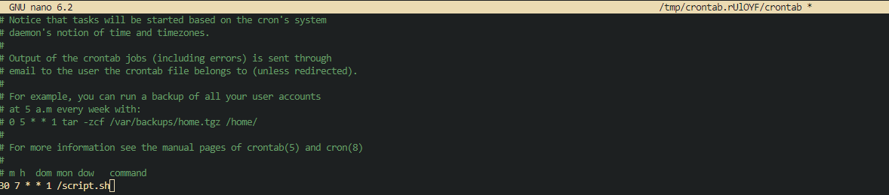

[Volver al indice de la unidad](../../index.md)

# Programación de tareas con ```cron```

Para esta práctica utilizare un ubuntu 22.04

## 1. ¿Con qué orden pondría con crontab los siguientes casos?

1. La tarea se ejecuta cada hora
   - 0 * * * *

2. La tarea se ejecuta los domingos cada 3 horas
   - 0 */3 * * 0

2. La tarea se ejecuta a las 12 de la mañana los días pares del mes.
   - 0 12 */2 * *

2. La tarea se ejecuta el primer día de cada mes a las 8 de la mañana y a las 8 de la tarde.
   - 0 8 1 * *
   - 0 20 1 * *

2. La tarea se ejecuta cada media hora de lunes a viernes.
   - */30 * * * 1-5

2. La tarea se ejecuta cada cuarto de hora, entre las 3 y las 8, de lunes a viernes, durante todo el mes de agosto
   - */15 3-8 * 8 1-5

2. La tarea se ejecuta cada 90 minutos
   - */90 * * * *

## 2. Como comprobar que el servicio cron está ejecutándose

Para saber si el servicio ```cron``` está activo tendremos que hacer es ejecutar el siguiente comando:

```bash
vagrant@ubuntu2204:~$ sudo systemctl status cron
● cron.service - Regular background program processing daemon
     Loaded: loaded (/lib/systemd/system/cron.service; enabled; vendor preset: enabled)
     Active: active (running) since Tue 2024-10-15 07:08:44 UTC; 42s ago
       Docs: man:cron(8)
   Main PID: 648 (cron)
      Tasks: 1 (limit: 2220)
     Memory: 13.7M
        CPU: 2.611s
     CGroup: /system.slice/cron.service
             └─648 /usr/sbin/cron -f -P

Oct 15 07:08:44 ubuntu2204.localdomain systemd[1]: Started Regular background program processing daemon.
Oct 15 07:08:44 ubuntu2204.localdomain cron[648]: (CRON) INFO (pidfile fd = 3)
Oct 15 07:08:44 ubuntu2204.localdomain cron[648]: (CRON) INFO (Running @reboot jobs)
Oct 15 07:08:45 ubuntu2204.localdomain CRON[660]: pam_unix(cron:session): session opened for user root(uid=0) by (uid=0)
Oct 15 07:08:45 ubuntu2204.localdomain CRON[729]: (root) CMD (command bash -c '/etc/cron.daily/mlocate')
Oct 15 07:08:45 ubuntu2204.localdomain CRON[659]: pam_unix(cron:session): session opened for user root(uid=0) by (uid=0)
lines 1-17
```

## 3. Cual es el efecto de la linea de crontab : ``` */15 1,2,3 * * * who > /tmp/test```

Es una tarea programada en crontab que significa que todos los dias a la 1,2 y 3 de la mañana, cada 15 minutos guardará el/los usuarios que estén utilizando el equipo en el archivo **test** dentro de **/tmp**

## 4. indica la ruta de crontab en el sistema

La ruta de crontab es la siguiente:

Fuente [Cibercity.biz](https://www.cyberciti.biz/faq/where-is-the-crontab-file/)

```bash
vagrant@ubuntu2204:~$ ls /var/spool/cron/
crontabs
vagrant@ubuntu2204:~$
```

## 5. Excepcionalmente se debe iniciar una tarea llamada ``script.sh`` todos los lunes a las 07:30h antes de entrar en clase ¿Cómo lo harías?

Tendriamos que editar el archivo crontab utilizando el siguiente comando:

```bash
vagrant@ubuntu2204:~$ crontab -e
```

Nos abrirá el editor de texto preferido que tengamos y dentro del archivo escribiremos la siguiente linea




## 6. Se ha cancelado la tarea, ¿cómo listar y suprimir la tarea?

Lo primero que debemos de hacer es listar. Para ello escribiremos el siguiente comando:

```bash
vagrant@ubuntu2204:~$ crontab -l
# Edit this file to introduce tasks to be run by cron.
#
# Each task to run has to be defined through a single line
# indicating with different fields when the task will be run
# and what command to run for the task
#
# To define the time you can provide concrete values for
# minute (m), hour (h), day of month (dom), month (mon),
# and day of week (dow) or use '*' in these fields (for 'any').
#
# Notice that tasks will be started based on the cron's system
# daemon's notion of time and timezones.
#
# Output of the crontab jobs (including errors) is sent through
# email to the user the crontab file belongs to (unless redirected).
#
# For example, you can run a backup of all your user accounts
# at 5 a.m every week with:
# 0 5 * * 1 tar -zcf /var/backups/home.tgz /home/
#
# For more information see the manual pages of crontab(5) and cron(8)
#
# m h  dom mon dow   command
30 7 * * 1 /script.sh
vagrant@ubuntu2204:~$
```

Como vemos en el código nos ha sacado nuestra tarea en crontab.

Ahora con el comando crontab -r eliminaremos la tarea

```bash
vagrant@ubuntu2204:~$ crontab -r
vagrant@ubuntu2204:~$ crontab -l
no crontab for vagrant
vagrant@ubuntu2204:~$
```

## 7. Ejecuta el comando ps -ef para el usuario root cada 2 minutos y redirecciona el resultado a /tmp/ps_result sin sobrescribir los antiguos.

Para ejecutar esta tarea en crontab tendremos que repetir los pasos que hicimos antes y añadiremos la orden en el **crontab**

```bash
crontab -e

#Añadiremos al archivo de crontab lo siguiente:
*/2 * * * * ps -ef --user root >> /tmp/ps_result
----------- ------  ----- ----    --------------
Frecuencia  Comando Atrib usuario    Fichero
de                               donde se guardara
ejecucion

```

Si vemos con un ```cat``` el archivo al cual redireccionamos el comando ps -ef veremos el siguiente contenido

> Si nos fijamos bien , el archivo cumple con lo que le mandamos en **crontab**
```bash
vagrant@ubuntu2204:~$ cat /tmp/ps_result
UID          PID    PPID  C STIME TTY          TIME CMD
vagrant     3579    3577  0 07:40 ?        00:00:00 /bin/sh -c ps -ef --user root >> /tmp/ps_result
vagrant     3580    3579  0 07:40 ?        00:00:00 ps -ef --user root
vagrant     3589    3588  0 07:42 ?        00:00:00 /bin/sh -c ps -ef --user root >> /tmp/ps_result
vagrant     3590    3589  0 07:42 ?        00:00:00 ps -ef --user root
vagrant     3598    3597  0 07:44 ?        00:00:00 /bin/sh -c ps -ef --user root >> /tmp/ps_result
vagrant     3599    3598  0 07:44 ?        00:00:00 ps -ef --user root
vagrant     3628    3627  0 07:46 ?        00:00:00 /bin/sh -c ps -ef --user root >> /tmp/ps_result
vagrant     3629    3628  0 07:46 ?        00:00:00 ps -ef --user root
```

## 8. Verifica la lista de tareas en crontab

Para verificar la lista de tareas en crontab ejecutaremos el siguiente comando

```bash
vagrant@ubuntu2204:~$ crontab -l
*/2 * * * * ps -ef --user root >> /tmp/ps_result
```

## 9. Verificar que funciona la tarea

```bash
vagrant@ubuntu2204:~$ cat /tmp/ps_result
UID          PID    PPID  C STIME TTY          TIME CMD
vagrant     3579    3577  0 07:40 ?        00:00:00 /bin/sh -c ps -ef --user root >> /tmp/ps_result
vagrant     3580    3579  0 07:40 ?        00:00:00 ps -ef --user root
vagrant     3589    3588  0 07:42 ?        00:00:00 /bin/sh -c ps -ef --user root >> /tmp/ps_result
vagrant     3590    3589  0 07:42 ?        00:00:00 ps -ef --user root
vagrant     3598    3597  0 07:44 ?        00:00:00 /bin/sh -c ps -ef --user root >> /tmp/ps_result
vagrant     3599    3598  0 07:44 ?        00:00:00 ps -ef --user root
vagrant     3628    3627  0 07:46 ?        00:00:00 /bin/sh -c ps -ef --user root >> /tmp/ps_result
vagrant     3629    3628  0 07:46 ?        00:00:00 ps -ef --user root
```

## 10. Crear usuario asir2 y prohibirle utilizar crontab

Primero creamos el usuario

```bash
vagrant@ubuntu2204:~$ sudo useradd -s /bin/bash asir2 -m
```

Fuente: [Prohibición usuario utilizar crontab](https://rm-rf.es/cron-linux-autorizar-o-denegar-su-uso-a-usuarios/)

Ahora iremos al directorio **/etc/cron.deny**. Aquí añadiremos el nombre del usuario que queremos que no utilice crontab

```bash
vagrant@ubuntu2204:~$ sudo nano /etc/cron.deny

# Añadimos en su interior el nombre del usuario
```

## 11. Verifica que el usuario asir2 realmente no puede utilizar crontab

Hacemos un ```su asir2``` y probamos a ejecutar el comando , por ejemplo, ```cronttab -l```

```bash
vagrant@ubuntu2204:~$ su asir2
Password: 
asir2@ubuntu2204:/home/vagrant$ cd /
asir2@ubuntu2204:/$ crontab -l
You (asir2) are not allowed to use this program (crontab)
See crontab(1) for more informatio
```

## 12. Programa crontab para que cada día a las 0:05 se eliminen todos los ficheros que se encuentran en el directorio /tmp.

Nos vamos a crontab y escribimos la siguiente orden

```bash
5 0 * * * rm /tmp/*
```

## 13. Programa una tarea en el sistema que se lance de lunes a viernes a las 9 de la mañana durante los meses de verano (julio, agosto y septiembre) que escriba en un fichero la hora actual (comando date, aunque tienes que mirar la ayuda para elegir un formato comprensible) seguido del listado de usuarios que hay conectados en ese momento en el sistema (comando who)

Lo primero que debemos de hacer es pensar como va a ser la orden de crontab

> De lunes a viernes a las 9am desde julio a septiembre == 0 9 1-5 7-9 *
>
> Formato de la fecha: date +"%d del %m de %Y a las %H:%M"
>
> Listado de usuarios : who

Ahora nos vamos al archivo de crontab y lo escribimos de seguido

```bash
0 9 1-5 7-9 * date +"%d del %m de %Y a las %H:%M" >> /home/vagrant/texto.txt && who >> /home/vagrant/texto.txt
```

## 14. Para que se utiliza cada archivo:

- cron.d: Contiene las tareas que se ejecutan en mo0mentos específicos que le ha asignado un usuario.
- cron.allow: Este archivo contiene a los usuarios que tienen permiso para utilizar crontab
- cron.deny: Este archivo hace lo contrario que el "allow"
- cron.daily: Las tareas que estén en este archivo se ejecutaran diariamente
- cron.hourly: Las tareas que estén en este archivo se ejecutaran cada hora
=======
[Volver al indice de la unidad](../../index.md)

# Programación de tareas con ```cron```

Para esta práctica utilizare un ubuntu 22.04

## 1. ¿Con qué orden pondría con crontab los siguientes casos?

1. La tarea se ejecuta cada hora
   - 0 * * * *

2. La tarea se ejecuta los domingos cada 3 horas
   - 0 */3 * * 0

2. La tarea se ejecuta a las 12 de la mañana los días pares del mes.
   - 0 12 */2 * *

2. La tarea se ejecuta el primer día de cada mes a las 8 de la mañana y a las 8 de la tarde.
   - 0 8 1 * *
   - 0 20 1 * *

2. La tarea se ejecuta cada media hora de lunes a viernes.
   - */30 * * * 1-5

2. La tarea se ejecuta cada cuarto de hora, entre las 3 y las 8, de lunes a viernes, durante todo el mes de agosto
   - */15 3-8 * 8 1-5

2. La tarea se ejecuta cada 90 minutos
   - */90 * * * *

## 2. Como comprobar que el servicio cron está ejecutándose

Para saber si el servicio ```cron``` está activo tendremos que hacer es ejecutar el siguiente comando:

```bash
vagrant@ubuntu2204:~$ sudo systemctl status cron
● cron.service - Regular background program processing daemon
     Loaded: loaded (/lib/systemd/system/cron.service; enabled; vendor preset: enabled)
     Active: active (running) since Tue 2024-10-15 07:08:44 UTC; 42s ago
       Docs: man:cron(8)
   Main PID: 648 (cron)
      Tasks: 1 (limit: 2220)
     Memory: 13.7M
        CPU: 2.611s
     CGroup: /system.slice/cron.service
             └─648 /usr/sbin/cron -f -P

Oct 15 07:08:44 ubuntu2204.localdomain systemd[1]: Started Regular background program processing daemon.
Oct 15 07:08:44 ubuntu2204.localdomain cron[648]: (CRON) INFO (pidfile fd = 3)
Oct 15 07:08:44 ubuntu2204.localdomain cron[648]: (CRON) INFO (Running @reboot jobs)
Oct 15 07:08:45 ubuntu2204.localdomain CRON[660]: pam_unix(cron:session): session opened for user root(uid=0) by (uid=0)
Oct 15 07:08:45 ubuntu2204.localdomain CRON[729]: (root) CMD (command bash -c '/etc/cron.daily/mlocate')
Oct 15 07:08:45 ubuntu2204.localdomain CRON[659]: pam_unix(cron:session): session opened for user root(uid=0) by (uid=0)
lines 1-17
```

## 3. Cual es el efecto de la linea de crontab : ``` */15 1,2,3 * * * who > /tmp/test```

Es una tarea programada en crontab que significa que todos los dias a la 1,2 y 3 de la mañana, cada 15 minutos guardará el/los usuarios que estén utilizando el equipo en el archivo **test** dentro de **/tmp**

## 4. indica la ruta de crontab en el sistema

La ruta de crontab es la siguiente:

Fuente [Cibercity.biz](https://www.cyberciti.biz/faq/where-is-the-crontab-file/)

```bash
vagrant@ubuntu2204:~$ ls /var/spool/cron/
crontabs
vagrant@ubuntu2204:~$
```

## 5. Excepcionalmente se debe iniciar una tarea llamada ``script.sh`` todos los lunes a las 07:30h antes de entrar en clase ¿Cómo lo harías?

Tendriamos que editar el archivo crontab utilizando el siguiente comando:

```bash
vagrant@ubuntu2204:~$ crontab -e
```

Nos abrirá el editor de texto preferido que tengamos y dentro del archivo escribiremos la siguiente linea


## 6. Se ha cancelado la tarea, ¿cómo listar y suprimir la tarea?

Lo primero que debemos de hacer es listar. Para ello escribiremos el siguiente comando:

```bash
vagrant@ubuntu2204:~$ crontab -l
# Edit this file to introduce tasks to be run by cron.
#
# Each task to run has to be defined through a single line
# indicating with different fields when the task will be run
# and what command to run for the task
#
# To define the time you can provide concrete values for
# minute (m), hour (h), day of month (dom), month (mon),
# and day of week (dow) or use '*' in these fields (for 'any').
#
# Notice that tasks will be started based on the cron's system
# daemon's notion of time and timezones.
#
# Output of the crontab jobs (including errors) is sent through
# email to the user the crontab file belongs to (unless redirected).
#
# For example, you can run a backup of all your user accounts
# at 5 a.m every week with:
# 0 5 * * 1 tar -zcf /var/backups/home.tgz /home/
#
# For more information see the manual pages of crontab(5) and cron(8)
#
# m h  dom mon dow   command
30 7 * * 1 /script.sh
vagrant@ubuntu2204:~$
```

Como vemos en el código nos ha sacado nuestra tarea en crontab.

Ahora con el comando crontab -r eliminaremos la tarea

```bash
vagrant@ubuntu2204:~$ crontab -r
vagrant@ubuntu2204:~$ crontab -l
no crontab for vagrant
vagrant@ubuntu2204:~$
```

## 7. Ejecuta el comando ps -ef para el usuario root cada 2 minutos y redirecciona el resultado a /tmp/ps_result sin sobrescribir los antiguos.

Para ejecutar esta tarea en crontab tendremos que repetir los pasos que hicimos antes y añadiremos la orden en el **crontab**

```bash
crontab -e

#Añadiremos al archivo de crontab lo siguiente:
*/2 * * * * ps -ef --user root >> /tmp/ps_result
----------- ------  ----- ----    --------------
Frecuencia  Comando Atrib usuario    Fichero
de                               donde se guardara
ejecucion

```

Si vemos con un ```cat``` el archivo al cual redireccionamos el comando ps -ef veremos el siguiente contenido

> Si nos fijamos bien , el archivo cumple con lo que le mandamos en **crontab**
```bash
vagrant@ubuntu2204:~$ cat /tmp/ps_result
UID          PID    PPID  C STIME TTY          TIME CMD
vagrant     3579    3577  0 07:40 ?        00:00:00 /bin/sh -c ps -ef --user root >> /tmp/ps_result
vagrant     3580    3579  0 07:40 ?        00:00:00 ps -ef --user root
vagrant     3589    3588  0 07:42 ?        00:00:00 /bin/sh -c ps -ef --user root >> /tmp/ps_result
vagrant     3590    3589  0 07:42 ?        00:00:00 ps -ef --user root
vagrant     3598    3597  0 07:44 ?        00:00:00 /bin/sh -c ps -ef --user root >> /tmp/ps_result
vagrant     3599    3598  0 07:44 ?        00:00:00 ps -ef --user root
vagrant     3628    3627  0 07:46 ?        00:00:00 /bin/sh -c ps -ef --user root >> /tmp/ps_result
vagrant     3629    3628  0 07:46 ?        00:00:00 ps -ef --user root
```

## 8. Verifica la lista de tareas en crontab

Para verificar la lista de tareas en crontab ejecutaremos el siguiente comando

```bash
vagrant@ubuntu2204:~$ crontab -l
*/2 * * * * ps -ef --user root >> /tmp/ps_result
```

## 9. Verificar que funciona la tarea

```bash
vagrant@ubuntu2204:~$ cat /tmp/ps_result
UID          PID    PPID  C STIME TTY          TIME CMD
vagrant     3579    3577  0 07:40 ?        00:00:00 /bin/sh -c ps -ef --user root >> /tmp/ps_result
vagrant     3580    3579  0 07:40 ?        00:00:00 ps -ef --user root
vagrant     3589    3588  0 07:42 ?        00:00:00 /bin/sh -c ps -ef --user root >> /tmp/ps_result
vagrant     3590    3589  0 07:42 ?        00:00:00 ps -ef --user root
vagrant     3598    3597  0 07:44 ?        00:00:00 /bin/sh -c ps -ef --user root >> /tmp/ps_result
vagrant     3599    3598  0 07:44 ?        00:00:00 ps -ef --user root
vagrant     3628    3627  0 07:46 ?        00:00:00 /bin/sh -c ps -ef --user root >> /tmp/ps_result
vagrant     3629    3628  0 07:46 ?        00:00:00 ps -ef --user root
```

## 10. Crear usuario asir2 y prohibirle utilizar crontab

Primero creamos el usuario

```bash
vagrant@ubuntu2204:~$ sudo useradd -s /bin/bash asir2 -m
```

Fuente: [Prohibición usuario utilizar crontab](https://rm-rf.es/cron-linux-autorizar-o-denegar-su-uso-a-usuarios/)

Ahora iremos al directorio **/etc/cron.deny**. Aquí añadiremos el nombre del usuario que queremos que no utilice crontab

```bash
vagrant@ubuntu2204:~$ sudo nano /etc/cron.deny

# Añadimos en su interior el nombre del usuario
```

## 11. Verifica que el usuario asir2 realmente no puede utilizar crontab

Hacemos un ```su asir2``` y probamos a ejecutar el comando , por ejemplo, ```cronttab -l```

```bash
vagrant@ubuntu2204:~$ su asir2
Password: 
asir2@ubuntu2204:/home/vagrant$ cd /
asir2@ubuntu2204:/$ crontab -l
You (asir2) are not allowed to use this program (crontab)
See crontab(1) for more informatio
```

## 12. Programa crontab para que cada día a las 0:05 se eliminen todos los ficheros que se encuentran en el directorio /tmp.

Nos vamos a crontab y escribimos la siguiente orden

```bash
5 0 * * * rm /tmp/*
```

## 13. Programa una tarea en el sistema que se lance de lunes a viernes a las 9 de la mañana durante los meses de verano (julio, agosto y septiembre) que escriba en un fichero la hora actual (comando date, aunque tienes que mirar la ayuda para elegir un formato comprensible) seguido del listado de usuarios que hay conectados en ese momento en el sistema (comando who)

Lo primero que debemos de hacer es pensar como va a ser la orden de crontab

> De lunes a viernes a las 9am desde julio a septiembre == 0 9 1-5 7-9 *
>
> Formato de la fecha: date +"%d del %m de %Y a las %H:%M"
>
> Listado de usuarios : who

Ahora nos vamos al archivo de crontab y lo escribimos de seguido

```bash
0 9 1-5 7-9 * date +"%d del %m de %Y a las %H:%M" >> /home/vagrant/texto.txt && who >> /home/vagrant/texto.txt
```

## 14. Para que se utiliza cada archivo:

- cron.d: Contiene las tareas que se ejecutan en mo0mentos específicos que le ha asignado un usuario.
- cron.allow: Este archivo contiene a los usuarios que tienen permiso para utilizar crontab
- cron.deny: Este archivo hace lo contrario que el "allow"
- cron.daily: Las tareas que estén en este archivo se ejecutaran diariamente
- cron.hourly: Las tareas que estén en este archivo se ejecutaran cada hora
- cron.monthly: Las tareas que estén en este archivo se ejecutaran mensualmente