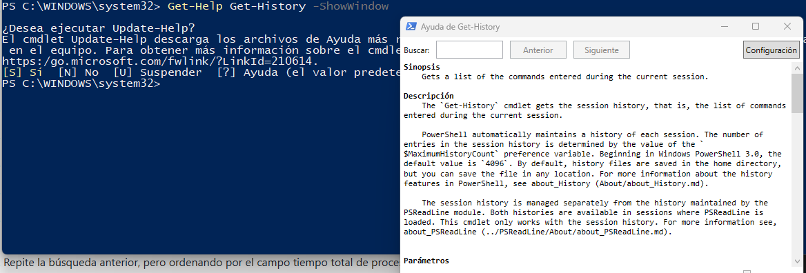

[Volver al índice](../index.md)

# PR0402: Introducción a Powershell II

## Ejercicios

### 1. Visualiza las últimas cinco entrdas del historial mostrando en cada una la hora de ejecución y el estado de ejecución

#### Comando:

```powershell
PS C:\Users\Administrador> Get-History -Count 5 | Select-Object CommandLine, StartExecutionTime, Status

```

#### Output:

```powershell
CommandLine                             StartExecutionTime                      Status
-----------                             ------------------                      ------
Measure-Command { Get-History -Count... 28/11/2024 10:11:04
Get-History | Select-Object Id, Comm... 28/11/2024 10:11:47
Get-History -Count 5 | Select-Object... 28/11/2024 10:12:05
Get-History -Count 5 | Select-Object... 28/11/2024 10:13:13
Get-History -Count 5 | Select-Object... 28/11/2024 10:13:21


PS C:\Users\Administrador>
```

### 2. Ejecutar el comando ```Get-Command``` e interrumpirlo antes de que finalice su ejecución


##### Ejecución con la detención utilizando ```Ctrl + C```

```
PS C:\Users\Administrador> Get-Command

CommandType     Name                                               ModuleName
-----------     ----                                               ----------
Alias           Add-ProvisionedAppxPackage                         Dism
Alias           Add-WindowsFeature                                 ServerManager
Alias           Apply-WindowsUnattend                              Dism
Alias           Expand-IscsiVirtualDisk                            IscsiTarget
Alias           Flush-Volume                                       Storage
Alias           Get-ProvisionedAppxPackage                         Dism
Alias           Initialize-Volume                                  Storage
Alias           Move-SmbClient                                     SmbWitness
Alias           Remove-ProvisionedAppxPackage                      Dism
Alias           Remove-WindowsFeature                              ServerManager
Alias           Write-FileSystemCache                              Storage
Function        A:
Function        Add-BCDataCacheExtension                           BranchCache
Function        Add-DnsClientNrptRule                              DnsClient
Function        Add-DtcClusterTMMapping                            MsDtc
Function        Add-InitiatorIdToMaskingSet                        Storage
Function        Add-NetEventNetworkAdapter                         NetEventPacketCapture
PS C:\Users\Administrador>
```

Si no paramos la ejecución del comando nos mostrará TODO el listado que tiene Powershell

### 3. Volver a ejecutar el comando del punto 1 y comprobar los dos diferentes estados de finalizacion

Utilizando el mismo comando no me aparece en la columna del status su estado

```powershell
PS C:\Users\Administrador> Get-History -Count 5 | Select-Object CommandLine, StartExecutionTime, Status

CommandLine                             StartExecutionTime                      Status
-----------                             ------------------                      ------
Get-History -Count 5 | Select-Object... 02/12/2024 11:57:52
Get-History                             02/12/2024 11:57:56
Get-Command                             02/12/2024 11:58:08
Get-Command                             02/12/2024 11:58:10
Get-History                             02/12/2024 11:58:16

```

Sin embargo si yo ejecuto el siguiente comando, me aparece ya el estado de ejecución de el comando.

```powershell
PS C:\Users\Administrador> Get-History | Format-List *
```

Y si nos fijamos en el output vemos lo siguiente:

```powershell
Id                 : 18
CommandLine        : Get-Command
ExecutionStatus    : Stopped
StartExecutionTime : 02/12/2024 12:03:19
EndExecutionTime   : 02/12/2024 12:03:19

Id                 : 19
CommandLine        : Get-Command
ExecutionStatus    : Completed
StartExecutionTime : 02/12/2024 12:03:21
EndExecutionTime   : 02/12/2024 12:03:22

Id                 : 20
CommandLine        : Get-History -Count 5 | Select-Object CommandLine, StartExecutionTime, Status
ExecutionStatus    : Completed
StartExecutionTime : 02/12/2024 12:03:24
EndExecutionTime   : 02/12/2024 12:03:24
```

### 4. Muestra todos los procesos con el nombre msedge mostrando su id, el consumo de CPU y los threads

Para mostrar los procesos de edge que hay con los requerimientos del enunciado, tenemos que introducir el siguiente comando:

> Importante tener al menos un proceso de Edge en ejecución

```powershell
PS C:\WINDOWS\system32> Get-Process msedge | Select-Object Id, CPU, Threads

   Id      CPU Threads
   --      --- -------
 3036 0,015625 {9420, 6588, 16928, 14944...}
 4128 1,828125 {16348, 17172, 4940, 17972...}
 4584 1,609375 {3892, 18344, 12432, 18888...}
 8904  1,59375 {13104, 4612, 16036, 6316...}
15788  0,40625 {18696, 13464, 18960, 7024...}
16412  0,15625 {15064, 15144, 5244, 18728...}
19148 0,046875 {18548, 5616, 5492, 1116...}


PS C:\WINDOWS\system32>
```

### 5. Averigua para que sirve el parametro ```delimiter``` del comando ```Export-CSV```

> [Documentación oficial de Microsoft: Delimiter](https://learn.microsoft.com/es-es/powershell/module/microsoft.powershell.utility/export-csv?view=powershell-7.4)

El parámetro delimiter especifica en el siguiente ejemplo que se está utilizando punto y coma para separar los valores de la cadena

```powershell
Get-Process | Export-Csv -Path .\Processes.csv -Delimiter ';'
```

Podemos poner el valor que queramos, pero se suele utilizar ```:``` o ```;```

### 6. Muestra en una ventana la ayuda del comando Get-History

Debemos de introducir el siguiente comando:

```powershell
PS C:\WINDOWS\system32> Get-Help Get-History -ShowWindow
```

Nos aparecerá de la siguiente manera



### 7. Mostrar un listado de todos los comandos que ontengan ```Update```

Si introducimos el siguiente comando utilizando asteriscos en vez de comillas veremos el siguiente output

```powershell
PS C:\WINDOWS\system32> Get-Command *Update*

CommandType     Name                                               Version    Source
-----------     ----                                               -------    ------
Alias           Get-AppPackageAutoUpdateSettings                   2.0.1.0    Appx
Alias           Get-MsixPackageAutoUpdateSettings                  2.0.1.0    Appx
Alias           Remove-AppPackageAutoUpdateSettings                2.0.1.0    Appx
Alias           Remove-MsixPackageAutoUpdateSettings               2.0.1.0    Appx
Alias           Set-AppPackageAutoUpdateSettings                   2.0.1.0    Appx
Alias           Set-MsixPackageAutoUpdateSettings                  2.0.1.0    Appx
Function        Get-WindowsUpdateLog                               1.0.0.0    WindowsUpdate
Function        Update-AutologgerConfig                            1.0.0.0    EventTracingManagement
Function        Update-Disk                                        2.0.0.0    Storage
Function        Update-DscConfiguration                            1.1        PSDesiredStateConfiguration
Function        Update-EtwTraceSession                             1.0.0.0    EventTracingManagement
Function        Update-HostStorageCache                            2.0.0.0    Storage
Function        Update-IscsiTarget                                 1.0.0.0    iSCSI
Function        Update-IscsiTargetPortal                           1.0.0.0    iSCSI
Function        Update-Module                                      1.0.0.1    PowerShellGet
```

### 8. Ejecuta la herramienta **Recortes** y localizala utilizando el comando ```Get-Process```. Se llama "SnippingTool.exe"

Ejecutaremos el siguiente comando:

> Nos basta con introducir lo siguiente
```powershell
PS C:\WINDOWS\system32> Get-Process -Name SnippingTool

Handles  NPM(K)    PM(K)      WS(K)     CPU(s)     Id  SI ProcessName
-------  ------    -----      -----     ------     --  -- -----------
   2956      57    80052     127200       0,30   3772   1 SnippingTool


PS C:\WINDOWS\system32>
```

### 9. Averigua qué propiedades tienen los procesos devueltos con el comando Get-Process

Las propiedades que nos devuelve por defecto el comando son:

```powershell
PS C:\WINDOWS\system32> Get-Process

Handles  NPM(K)    PM(K)      WS(K)     CPU(s)     Id  SI ProcessName
-------  ------    -----      -----     ------     --  -- -----------
```

> [Documentación ofical: Get-Process](https://learn.microsoft.com/es-es/powershell/module/microsoft.powershell.management/get-process?view=powershell-7.4#notes)

1. Handles
   1. Los Handles son el número de identificadores que el proceso ha abierto
2. NPM
   1. La cantidad de memoria no paginada que utiliza el proceso
3. PM
   1. La cantidad de memoria paginable que utiliza el proceso
4. WS
   1. Tamaño del conjunto del trabajo
5. CPU
   1. Cantidad de tiempo de procesador que el proceso ha utilizado en los procesadores
6. Id
   1. Identificador del proceso
7. SI
   1. No lo he encontrado en la documentación oficial
8. ProcessName
   1. Nombre del proceso


### 10. Busca en la ayuda para que sirve el parámetro ```-MemberType``` del comando ```Get-Member```

El parámetro ```-MemberType``` Especifica el tipo de miembro que obtiene de ese cmdlet. El valor predeterminado es **ALL**

### 11. Finalizar desde la linea de comandos el proceso de la herramienta ```Recortes```.

Para finalizar el proceso de la herramienta Recortres, tenemos que introducir lo siguiente:

```powershell
PS C:\WINDOWS\system32> Get-Process SnippingTool

Handles  NPM(K)    PM(K)      WS(K)     CPU(s)     Id  SI ProcessName
-------  ------    -----      -----     ------     --  -- -----------
   2929      54    79512      72024       0,36   3772   1 SnippingTool


PS C:\WINDOWS\system32> Stop-Process -Id 3772
```

### 12. Muestra todos los procesos que tienen el nombre de ```svchost```

Utilizaremos el comando **Get-Process** y nos mostrará todos los procesos ejecutados actualemnte por "svchost"

```powershell
PS C:\WINDOWS\system32> Get-Process -Name svchost

Handles  NPM(K)    PM(K)      WS(K)     CPU(s)     Id  SI ProcessName
-------  ------    -----      -----     ------     --  -- -----------
    148      26     5948       7584       0,75    872   0 svchost
    209      13     1996       8864       0,14    920   0 svchost
    417      14     3472      17384       0,98   1208   0 svchost
    313      19     3772      10888       6,81   1540   0 svchost
    419      20    12236      28152       1,98   1668   0 svchost
   1322      27    10628      35048       8,97   1716   0 svchost
   1345      23     8900      19388      17,69   1884   0 svchost
    336      12     3348      10804      14,13   1936   0 svchost
    107      13     1588       6396       0,36   2040   0 svchost
    258      12     3088       9500       2,14   2056   0 svchost
    261      14     3332      11656       0,28   2068   0 svchost
    282      10     2312      14368       0,30   2076   0 svchost
    222      10     2368       9568       0,14   2196   0 svchost
    124      11     1884       6588       0,09   2220   0 svchost
    241      12     2660      10724      10,22   2272   0 svchost
    460      34    17372      25468       4,22   2320   0 svchost
   1045      22     5984      18828       3,05   2328   0 svchost
    343      19     6800      13568       4,45   2840   0 svchost
```

### 13. Muestra por pantalla el número de instancias de proceso ```svchost```

Si queremos mostrar por pantalla cuantas instancias tiene el proceso svchost, tenemos que contar cuantos procesos hay.
Para ello ejecutamos lo siguiente:

```powershell
PS C:\WINDOWS\system32> Get-Process svchost | Measure-Object | Select-Object -ExpandProperty Count
73
PS C:\WINDOWS\system32>
```

### 14. Muestra por pantalla los procesos de ```svchost```. Mostrando nombre,identificador,hora de inicio ,tiempo total del procesador y clase de prioridad. En forma tabular

Tenemos que introducir el siguiente comando

```powershell
PS C:\WINDOWS\system32> Get-Process svchost | Format-List Name, Id, StartTime, CPU, PriorityClass
```

> El output del comando es muy extenso

```powershell
Name          : svchost
Id            : 872
StartTime     : 02/12/2024 8:40:31
CPU           : 0,78125
PriorityClass : AboveNormal
``` 

### 15. 