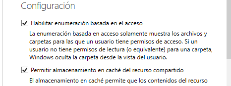
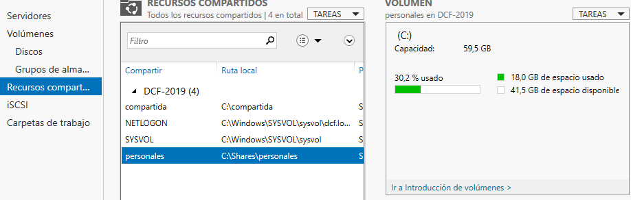
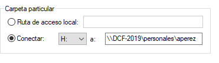
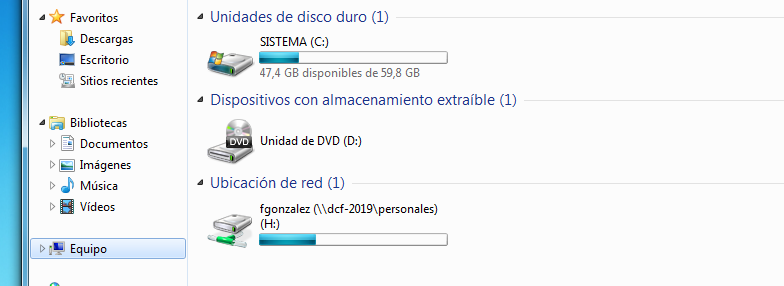
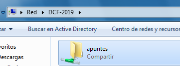

[Volver al índice](../index.md)

# PR0501: Carpetas personales y compartidas por un grupo

## Creación de usuarios y grupos

Podemos crear de varias formas los usuarios y el grupo. En mi caso he utilizado el panel de administración de Active Directory

## Carpetas personales

Comprobamos que tenemos instalado el rol de **Administrador de recursos del servidor de archivos**.

### Creación de carpeta compartida

Nos vamos a los servicios de archivos y almacenamiento y creamos la siguiente carpeta compartida.

Le vamos a dar permisos de carpeta compartida a los usuarios del dominio

Habilitamos la enumeracion basada en el acceso

Creamos la carpeta y nos aparecerá de la siguiente formas

### Asignación de carpeta de perfil a unidad de red

Nos vamos a la configuración de cada una de las cuentas que hemos creado y le asignamos lo siguiente en el apartado de perfil

- Importante a cada perfil la suya dentro de la carpeta **personales**

### Comprobación desde el usuario

Si iniciamos sesión con el usuario en cuestion y nos vamos al explorador de archivos nos tiene que aparecer automáticamente la unidad de red conectada

## Crear carpetas compartidas por un grupo

Ahora vamos a hacer algo similar.Crearemos dentro de la carpeta shares una carpeta compartida en la cual, los usuarios del grupo alumnos , **aperez** y **fgonzalez** la vean

