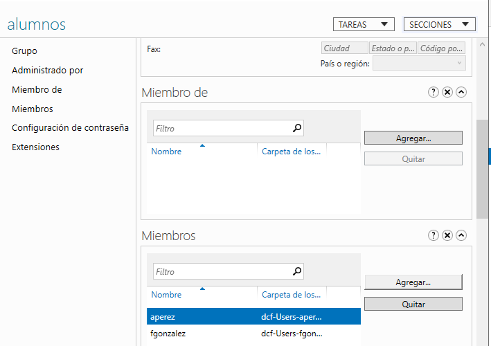

[Volver al índice](../index.md)

# PR0501: Carpetas personales y compartidas por un grupo

## Creación de usuarios y grupos

Podemos crear de varias formas los usuarios y el grupo. En mi caso he utilizado el panel de administración de Active Directory

## Carpetas personales

Comprobamos que tenemos instalado el rol de **Administrador de recursos del servidor de archivos**.

### Creación de carpetas
