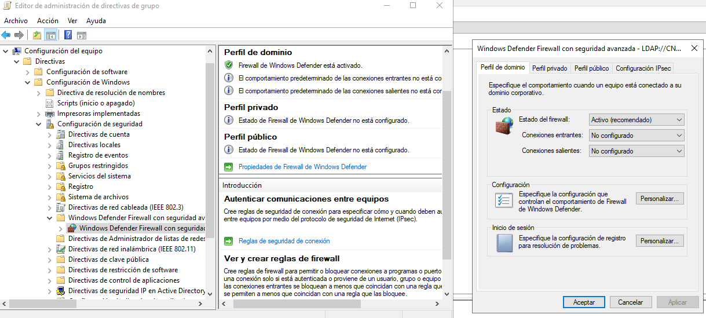

[Volver al índice](../index.md)

# Aplicación de directivas

## Requisitos

VAmos a crear la siguiente serie de UOs en nuestro dominio. Como resultado tiene que aparecer lo siguiente

## Directivas

### Directiva 1

Primero crearemos la GPO dentro de la unidad organizativa utilizando el click derecho del raton.

Una vez creada, damos con click derecho en la GPO y la editamos.

Buscaremos la política de  **impedir cambiar el fondo de pantalla** y la habilitaremos

### Directiva 2

Creamos la GPO de **Ejecución de scripts de Powershell sin restricciones**.

Acto seguido, la editamos y buscamos en :

Configuración del equipo -> Directivas -> Componentes -> Windows Powershell

Para habilitarla tenemos que aclarar el comportamiento de esta GPO. En su menu de configuración la habilitaremos de la siguiente forma

### Directiva 3

tenemos que configurar a todos los equipos del dominio la directiva de **El firewall de Windows está habilitado**.

Como condicionante tenemos que esta directiva no puede aplicarse a un equipo llamado : "DEV-PC1"

Para ello creamos la directiva y la editamos de la siguiente manera:

Como vemos en la imagen solo estamos activandolo para el perfil de dominio

Ahora vamos a crear un filtro WMI. Le asignaremos la siguiente consulta excluyendo cualquier equipo que se llame DEV-PC1

Nos volvemos a la GPO y le aplicamos el filtro de la siguiente forma:

### Directiva 4

Tenemos que configurar a todos los equipos del dominio que las actualizaciones se descarguen automaticamente y se instalen fuera del horario laboral

Para ello creamos la GPO en el dominio y buscamos en la siguiente direccion la política.

