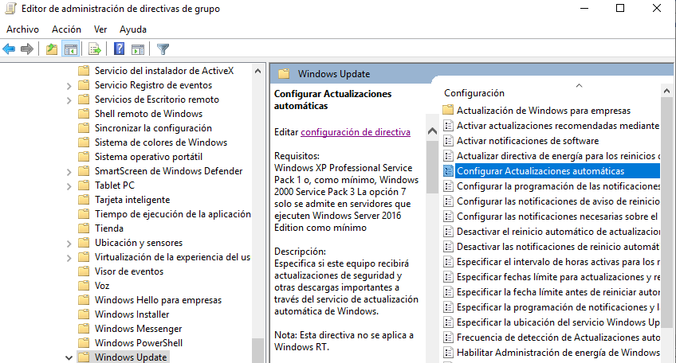

[Volver al índice](../index.md)

# Aplicación de directivas

## Requisitos

VAmos a crear la siguiente serie de UOs en nuestro dominio. Como resultado tiene que aparecer lo siguiente

## Directivas

### Directiva 1

Primero crearemos la GPO dentro de la unidad organizativa utilizando el click derecho del raton.

Una vez creada, damos con click derecho en la GPO y la editamos.

Buscaremos la política de  **impedir cambiar el fondo de pantalla** y la habilitaremos

### Directiva 2

Creamos la GPO de **Ejecución de scripts de Powershell sin restricciones**.

Acto seguido, la editamos y buscamos en :

Configuración del equipo -> Directivas -> Componentes -> Windows Powershell

Para habilitarla tenemos que aclarar el comportamiento de esta GPO. En su menu de configuración la habilitaremos de la siguiente forma

### Directiva 3

tenemos que configurar a todos los equipos del dominio la directiva de **El firewall de Windows está habilitado**.

Como condicionante tenemos que esta directiva no puede aplicarse a un equipo llamado : "DEV-PC1"

Para ello creamos la directiva y la editamos de la siguiente manera:

Como vemos en la imagen solo estamos activandolo para el perfil de dominio

Ahora vamos a crear un filtro WMI. Le asignaremos la siguiente consulta excluyendo cualquier equipo que se llame DEV-PC1

Nos volvemos a la GPO y le aplicamos el filtro de la siguiente forma:

### Directiva 4

Tenemos que configurar a todos los equipos del dominio que las actualizaciones se descarguen automaticamente y se instalen fuera del horario laboral

Para ello creamos la GPO en el dominio y buscamos en la siguiente direccion la política.

Como tenemos que establecer que las actualizaciones se apliquen fuera del horario laboral, tenemos que realizar la siguiente configuración

He establecido que las 5 de la mañana la "empresa" no tiene actividad laboral y por lo tanto es el horario idóneo para aplicar las actualizaciones

### Directiva 5

Vamos a desactivar el acceso de lectura y escritura a dispositivos USB.

Como se aplica a todos los usuarios del dominio, lo incluiremos con las demás.

Buscaremos en Configuración de equipo -> Directivas -> Plantillas administrativas -> Sistema -> Acceso de almacenamiento extraíble la política

Como vemos son dos políticas por separado. Ambas las habilitaremos

### Directiva 6

El usuario no podrá repetir ninguna de las 10 últimas contraseñas

Se aplica a todos los usuarios del dominio pero a los usuarios **mgmt_director** y **dvlp_directo** se le aplicara la politica para que sean en vez de las 10 últimas, las 2.

Primero creamos la GPO y buscamos que política aplicarle

Como vemos en la imagen le hemos establecido a todos los usuarios del dominio que recuerde las 10 últimas contraseñas.

Ahora lo que tenemos que hacer es aplicar las excepciones

Las aplicaremos haciendo otra GPO y esa GPO la vincularemos a ambas UOs

UOS:
1. Development : 
2. Management : 

### Directiva 7